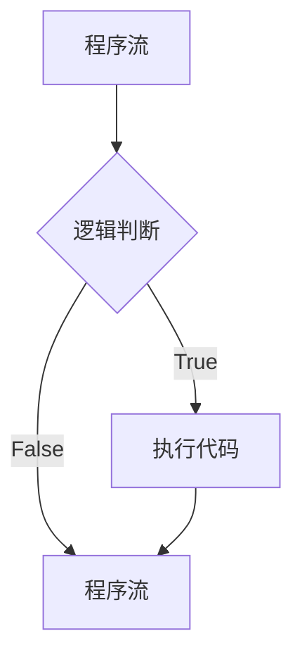
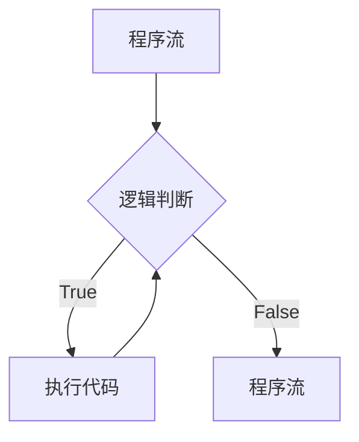

## Logic for


```flow
st=>start: 程序流
cond=>condition: 逻辑判断
condcode=>operation: 条件代码
e=>end: 程序流
st->cond
cond(no)->e
cond(yes)->condcode
condcode->e
```


## loop-for

```flow
st=>start: 程序流
cond=>condition: 循环条件
condcode=>operation: 条件代码
e=>end: 程序流

st->cond
cond(yes)->condcode
cond(no)->e
condcode->cond
```

## loop-while

```flow
st=>start: 程序流
cond=>condition: 循环条件
condcode=>operation: 条件代码
e=>end: 程序流

st->cond
cond(yes)->condcode
cond(no)->e
condcode->cond

```




