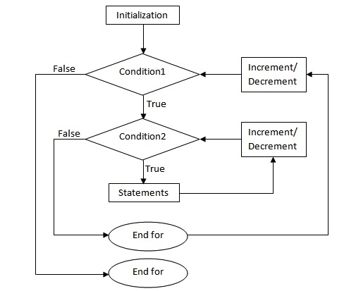
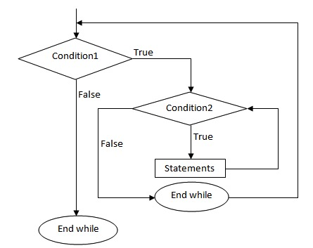
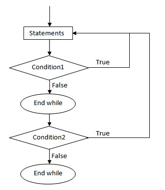

# C语言 嵌套循环

C 语言允许在一个循环内使用另一个循环，下面演示几个实例来说明这个概念。

## 语法

C 语言中 **嵌套 for 循环** 语句的语法：

```c
for (initialization; condition; increment/decrement)
{
    statement(s);
    for (initialization; condition; increment/decrement)
    {
        statement(s);
        ... ... ...
    }
    ... ... ...
}
```

流程图：



C 语言中 **嵌套 while 循环** 语句的语法：

```c
while (condition1)
{
    statement(s);
    while (condition2)
    {
        statement(s);
        ... ... ...
    }
    ... ... ...
}
```

流程图：



C 语言中 **嵌套 do...while 循环** 语句的语法：

```c
do
{
    statement(s);
    do
    {
        statement(s);
        ... ... ...
    }while (condition2);
    ... ... ...
}while (condition1);
```

流程图：



关于嵌套循环有一点值得注意，您可以在任何类型的循环内嵌套其他任何类型的循环。比如，一个 for 循环可以嵌套在一个 while 循环内，反之亦然。

## 实例

下面的程序使用了一个嵌套的 for 循环来查找 2 到 100 中的质数：

## for 嵌套实例

文件名:loopnested-for.c

```c
#include <stdio.h>
 
int main ()
{
   /* 局部变量定义 */
   int i, j;
   
   for(i=2; i<100; i++) {
      for(j=2; j <= (i/j); j++)
        if(!(i%j)) break; // 如果找到，则不是质数
      if(j > (i/j)) printf("%d 是质数\n", i);
   }
 
   return 0;
}
```

```bash
gcc /share/lesson/c/loopnested-for.c && ./a.out
```

康康

## while 嵌套实例

文件名:loopnested-while.c

```c
#include <stdio.h>
int main()
{
    int i=1,j;
    while (i <= 5)
    {
        j=1;
        while (j <= i )
        {
            printf("%d ",j);
            j++;
        }
        printf("\n");
        i++;
    }
    return 0;
}
```

```bash
gcc /share/lesson/c/loopnested-while.c && ./a.out
```

康康

## do-while 嵌套实例

文件名:loopnested-dowhile.c

```c
#include <stdio.h>
int main()
{
    int i=1,j;
    do
    {
        j=1;
        do
        {
            printf("*");
            j++;
        }while(j <= i);
        i++;
        printf("\n");
    }while(i <= 5);
    return 0;
}
```

```bash
gcc /share/lesson/c/loopnested-dowhile.c && ./a.out
```

康康