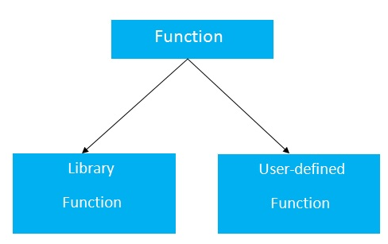

# C++ 函数(function)		

C++语言中的函数在其他编程语言中也称为过程或子例程。

我们可以创建函数来执行任何任务。 一个函数可以调用多次。 它提供模块化和代码可重用性。

## C++中函数的优点

函数有很多优点，但这里主要介绍以下两点：

**1. 提高代码可重用性**

通过在C++中创建函数，可以调用函数多次。 所以实现相同的功能不需要一遍又一遍地编写相同的代码。

**2. 代码优化**

函数能使代码优化，我们不需要写很多代码。
假设，要检查`3`个数字(`531`,`883`和`781`)是否是素数。 如果不使用函数，需要编写计算质数逻辑程序`3`次。 所以，这里就产生了不必要的重复代码。

## 函数类型

C++编程语言中有两种类型的函数：

1. 库函数：
   是在C++头文件中声明的函数，如:`ceil(x)`，`cos(x)`，`exp(x)`等。

**2. 用户定义的函数：** 是由C++程序员创建的函数，以便他/她可以多次使用它。 它降低了大程序的复杂性并优化了代码。



```cpp
return_type function_name(data_type parameter...)  
{    
    //code to be executed    
}
```

**C++函数示例**

下面来看看看C++函数的简单例子。

文件名:function.cpp

```cpp
#include <iostream>  
using namespace std;  
void func() {    
    static int i=0; //static variable    
    int j=0; //local variable    
    i++;    
    j++;    
    cout<<"i=" << i<<" and j=" <<j<<endl;    
}    
int main()  
{  
    func();    
    func();    
    func();
    return 0;
}
```

```bash
g++ /share/lesson/cpp/function.cpp && ./a.out
```

康康