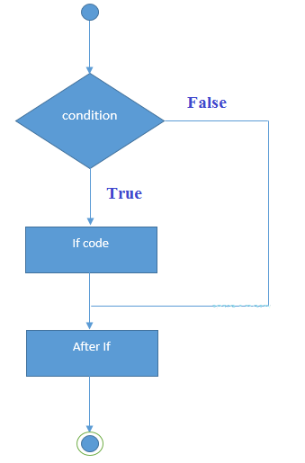
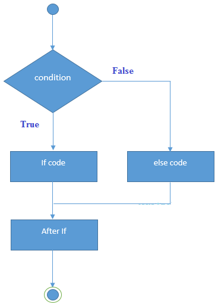

# C++ if-else语句

在C++编程中，**if语句**用于测试条件。 在C++中有多种类型的**if语句**，它们分别如下所示 -

- `if`语句
- `if-else`语句
- 嵌套`if`语句
- `if-else-if`阶梯

## C++ if语句

C++ **if语句**测试条件。 如果条件为真，则执行。

```cpp
if(condition){    
    //code to be executed    
}
```

C++ if语句的执行流程图如下所示



**C++ if语句示例**

文件名:logic-if.cpp

```cpp
#include <iostream>  
using namespace std;  

int main () {  
    int num = 10;    
    if (num % 2 == 0)    
    {    
        cout<<"It is even number";    
    }   
    return 0;  
}
```

```bash
g++ /share/lesson/cpp/logic-if.cpp && ./a.out
```

康康

## C++ if-else语句

C++ `if-else`语句也测试条件。 如果`if`条件为真，则执行`if`块中的代码，否则执行`else`块中的代码。

```cpp
if(condition){    
    //code if condition is true    
}else{    
    //code if condition is false    
}
```

if-else执行的流程如下图中所示 



**C++ if-else示例**

文件名:logic-ifelse.cpp

```cpp
#include <iostream>  
using namespace std;  
int main () {  
   int num = 11;    
   if (num % 2 == 0)    
   {    
       cout<<"It is even number";    
   }   
   else  
   {    
       cout<<"It is odd number";    
   }  
   return 0;  
}
```

执行上面代码得到以下结果 -

```cpp
g++ /share/lesson/cpp/logic-ifelse.cpp && ./a.out
```

**C++ if-else示例：带有来自用户的输入**

文件名:logic-ifelse-input.cpp

```cpp
#include <iostream>  
using namespace std;  
int main () {  
    int num;  
    cout<<"Enter a Number: ";  
    cin>>num;  
    if (num % 2 == 0)    
    {    
        cout<<"It is even number"<<endl;    
    }   
    else  
    {    
        cout<<"It is odd number"<<endl;    
    }  
   return 0;  
}
```

执行上面代码得到以下结果 -

```bash
g++ /share/lesson/cpp/logic-ifelse-input.cpp && ./a.out
```

## C++ if-else-if梯形语句

C++ if-else-if梯形语句用于从多个语句中执行一个条件。

**语法：**

```cpp
if(condition1){    
    //code to be executed if condition1 is true    
}else if(condition2){    
    //code to be executed if condition2 is true    
}    
else if(condition3){    
    //code to be executed if condition3 is true    
}    
...    
else{    
    //code to be executed if all the conditions are false    
}
```

**C++ if-else-if示例**

文件名:logic-ifelsefi.cpp

```cpp
#include <iostream>  
using namespace std;  
int main () {  
       int num;  
       cout<<"Enter a number to check grade:";    
       cin>>num;  
       if (num <0 || num >100)    
       {    
           cout<<"wrong number\n";    
       }    
       else if(num >= 0 && num < 50){    
           cout<<"Fail\n";    
       }    
       else if (num >= 50 && num < 60)    
       {    
           cout<<"D Grade\n";    
       }    
       else if (num >= 60 && num < 70)    
       {    
           cout<<"C Grade\n";    
       }    
       else if (num >= 70 && num < 80)    
       {    
           cout<<"B Grade\n";    
       }    
       else if (num >= 80 && num < 90)    
       {    
           cout<<"A Grade\n";    
       }    
       else if (num >= 90 && num <= 100)    
       {    
           cout<<"A+ Grade\n";  
       }
    return 0;
}
```

```bash
g++ /share/lesson/cpp/logic-ifelsefi.cpp && ./a.out
```

