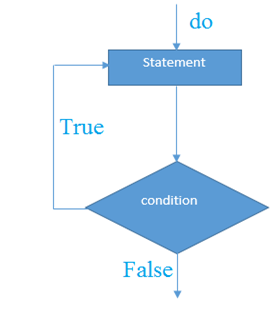

# C++ do-while循环

C++ **do-while循环**用于重复程序的一部分几次(或多次)。如果迭代次数不固定，并且必须至少执行一次循环，建议使用`do-while`循环。
C++ **do-while循环**至少要执行一次，因为在循环体之后检查条件。

**do-while循环的语法如下所示**

```cpp
do{    
    //code to be executed    
}while(condition);
```

**do-while循环的执行流程图**


**C++ do-while循环示例**

下面来看看一个简单的C++ do-while循环打印从`1`到`10`的例子。

文件名:loop-dowhile.cpp

```cpp
#include <iostream>  
using namespace std;  
int main() {  
   int i = 1;    
    do{    
        cout<<i<<"\n";    
        i++;    
    } while (i <= 10) ;
    return 0;
}
```

执行上面代码，得到以下结果

```bash
g++ /share/lesson/cpp/loop-dowhile.cpp && ./a.out
```

## C++嵌套do-while循环

在C++中，如果在一个do-while循环中使用另一个do-while循环，它被称为嵌套do-while循环。对于每一次外部do-while循环，完全执行嵌套do-while循环。

下面来看看一个简单的C++嵌套do-while循环的例子。

文件名:loop-dowhile-nested.cpp

```cpp
#include <iostream>  
using namespace std;  
int main() {  
    int i = 1;    
    do{    
        int j = 1;          
        do{    
            cout<<j<<"\n";        
            j++;    
        } while (j <= 3) ;
        cout<<i;
        i++;    
    } while (i <= 3) ;     
    return 0;
}
```

执行上面代码，得到以下结果 -

```bash
g++ /share/lesson/cpp/loop-dowhile-nested.cpp && ./a.out
```

## C++无限do-while循环

在C++中，如果在do-while循环中传递条件为`true`，它将是无限do-while循环。

**无限do-while循环语法**

```cpp
do{    
    //code to be executed    
}while(true);
```

**C++无限do-while循环示例**

文件名:loop-dowhile-inf.cpp

```cpp
#include <iostream>  
using namespace std;  
int main() {  
    do{    
        cout<<"Infinitive do-while Loop"<<endl;    
    } while(true);
    return 0;
}
```

```bash
g++ /share/lesson/cpp/loop-dowhile-inf.cpp && ./a.out
```

注意：按**Ctrl+C**结束这个无限循环