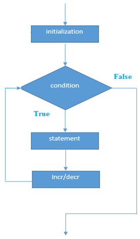

# C++ for循环

C++ **for循环**用于重复程序的一部分几次(或多次)。 如果迭代次数是固定的，建议使用`for`循环，其次是`while`或`do-while`循环。

C++中的**for循环**与C/C＃中的**for循环**相同。 我们可以初始化变量，检查条件，然后增量/减量值。

**for循环的语法如下所示**

```cpp
for(initialization; condition; incr/decr){    
    //code to be executed    
}
```

**for循环的流程图如下** -



**for循环的示例**

文件名:loop-for.cpp

```cpp
#include <iostream>  
using namespace std;  
int main() {  
    for(int i=1;i<=10;i++){      
        cout<<i <<"\n";      
    }
    return 0;
}
```

```bash
g++ /share/lesson/cpp/loop-for.cpp && ./a.out
```

康康

## C++嵌套for循环

在C++中，我们可以在另一个for循环中使用for循环，它被称为嵌套for循环。 当外环被执行一次时，内循环被完全执行。 因此，如果外循环和内循环执行`4`次，内循环将对于每个外循环执行`4`次，即总共`16`次。

**C++嵌套for循环示例**

下面来看看一个简单的C++嵌套for循环的例子。

文件名:loop-for-nested.cpp

```cpp
#include <iostream>  
using namespace std;  

int main () {  
    for(int i=1;i<=3;i++){      
        for(int j=1;j<=3;j++){      
            cout<<i<<" "<<j<<"\n";      
        }     
    }
    return 0;
}
```

```bash
g++ /share/lesson/cpp/loop-for.cpp && ./a.out
```

## C++无限循环

如果在for循环中使用双分号，它将执行无限次。 下面来看看一个C++中无限循环的简单例子。

文件名:loop-for-inf.cpp

```cpp
#include <iostream>  
using namespace std;  

int main () {  
    for (; ;)    
    {    
        cout<<"Infinitive For Loop"<<endl;    
    }
    return 0;
}
```

```bash
g++ /share/lesson/cpp/loop-for-inf.cpp && ./a.out
```

注意：按**Ctrl+C**结束这个无限循环