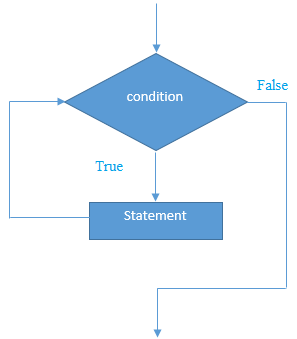

# C++ while循环

在C++中，**while循环**用于重复程序的一部分几次(或多次)。 如果迭代次数不固定，建议使用while循环而不是`for`循环。

下面是**while循环**的语法

```cpp
while(condition){    
    //code to be executed    
}
```

**while循环**的执行流程图-



C++ **while循环**示例
下面来看看下面一个简单的例子，使用`while`循环打印从`1`到`10`的数字。

文件名:loop-while.cpp

```cpp
#include <iostream>  
using namespace std;  
int main() {         
    int i=1;      
    while(i<=10)   
    {      
        cout<<i <<"\n";    
        i++;  
    }
    return 0;
}
```

```bash
g++ /share/lesson/cpp/loop-while.cpp && ./a.out
```

**C++嵌套While循环示例**

在C++中，可以在另一个while循环中使用while循环，它被称为嵌套while循环。执行一次外部循环时，嵌套while循环完全执行。
下面来看看一个在C++编程语言中嵌套while循环的简单例子。

文件名:loop-while-nested.cpp

```cpp
#include <iostream>  
using namespace std;  
int main () {  
    int i=1;      
    while(i<=3)     
    {    
        int j = 1;    
        while (j <= 3)    
        {      
            cout<<i<<" "<<j<<"\n";      
            j++;  
        }     
        i++;  
    }
    return 0;
}
```

```bash
g++ /share/lesson/cpp/loop-while-nested.cpp && ./a.out
```

康康

**C++无限循环示例：**

还可以通过传递`true`作为测试条件，来创建无限while循环。

文件名:loop-while-inf.cpp

```cpp
#include <iostream>  
using namespace std;  
int main () {  
    while(true)  
    {    
        cout<<"Infinitive While Loop";    
    }
    return 0;
}
```

```bash
g++ /share/lesson/cpp/loop-while-inf.cpp && ./a.out
```

注意：按**Ctrl+C**结束这个无限循环