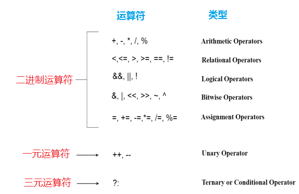

# C++ 运算符(operator)

运算符只是用于执行操作的符号。 可以有许多类型的操作，如：算术，逻辑，按位等运算符。
有以下类型的运算符在C语言中执行不同类型的操作。

- 算术运算符
- 关系运算符
- 逻辑运算符
- 按位运算符
- 赋值运算符
- 一元运算符
- 三元或条件运算符
- 杂项操作员



## 在C++中运算符的优先级

运算符优先级高的运算符将首先被评估求值。 关联性指定要评估求值的运算符方向，它可以是从左到右或从右到左。

让我们通过下面的例子来理解运算符的优先级：

```cpp
int data = 5 + 10 * 10;
```

“`data`”变量计算的结果值为：`105`，因为`*`(乘法运算符)是在`+`(加法运算符)之前求值，这是因为`*`(乘法运算符)优先级较高。

C++操作符的优先级和关联性如下：

| 类别     | 运算符                                                 | 相关性 |
| -------- | ------------------------------------------------------ | ------ |
| 后缀     | `()` `[]`` ->` `.` `++` `--`                           | 左到右 |
| 一元     | `+` `-` `!` `~` `++` `--` `(type)` `*` `&` `sizeof`    | 右到左 |
| 乘法     | `*` `/` `%`                                            | 左到右 |
| 加法     | `+` `-`                                                | 右到左 |
| 移位     | `<<` `>>`                                              | 左到右 |
| 关系     | `<` `<=` `>` `>=`                                      | 左到右 |
| 相等     | `==` `!=`                                              | 右到左 |
| 按位与   | `&`                                                    | 左到右 |
| 按位异或 | `^`                                                    | 左到右 |
| 按位或   | `|`                                                    | 右到左 |
| 逻辑与   | `&&`                                                   | 左到右 |
| 逻辑或   | `||`                                                   | 左到右 |
| 条件     | `?:`                                                   | 右到左 |
| 分配     | `=` `+=` `-=` `*=` `/=` `%=` `>>=` `<<=` `&=` `^=` `|` | 左到右 |
| 逗号     | `,`                                                    | 左到右 |