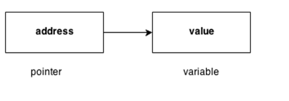

# C++ 指针(pointer)

C++语言中的指针是一个变量，它也称为定位符或指示符，它是指向一个值的地址。



**指针的优点**

1. 指针减少代码并提高性能，它用于检索字符串，树等，并与数组，结构和函数一起使用。
2. 我们可以使用指针从函数返回多个值。
3. 它能够访问计算机内存中的任何内存位置。

**指针的使用**

在C++语言中有许多指针的使用。

1. 动态内存分配
   在c语言中，可以使用`malloc()`和`calloc()`函数动态分配内存，其中使用的就是指针。
2. 数组，函数和结构体
   C语言中的指针被广泛用于数组，函数和结构体中。 它减少了代码并提高了性能。

## 指针中使用的符号

| 符号 | 名称       | 描述             |
| ---- | ---------- | ---------------- |
| `&`  | 地址运算符 | 获取变量的地址。 |
| `*`  | 间接运算符 | 访问地址的值。   |

## 声明指针

C++语言中的指针可以使用`*`(星号符号)声明。

```cpp
int ∗   a; //pointer to int    
char ∗  c; //pointer to char
```

## 指针示例

下面来看看看使用指针打印地址和值的简单例子。

文件名:pointer1.cpp

```cpp
#include <iostream>  
using namespace std;  
int main()  
{  
    int number = 30;    
    int *p;     
    p = &number;//stores the address of number variable    
    cout<<"Address of number variable is:"<<&number<<endl;    
    cout<<"Address of p variable is:"<<p<<endl;    
    cout<<"Value of p variable is:"<<*p<<endl;    
    return 0;  
}
```

```bash
g++ /share/lesson/cpp/pointer1.cpp && ./a.out
```

**在不使用第三个变量的情况下交换2个数字的指针程序示例**

文件名:pointer2.cpp

```cpp
#include <iostream>  
using namespace std;  
int main()  
{  
    int a=20,b=10,*p1=&a,*p2=&b;    
    cout<<"Before swap: *p1="<<*p1<<" *p2="<<*p2<<endl;    
    *p1=*p1+*p2;    
    *p2=*p1-*p2;    
    *p1=*p1-*p2;    
    cout<<"After swap: *p1="<<*p1<<" *p2="<<*p2<<endl;    
    return 0;  
}
```

```bash
g++ /share/lesson/cpp/pointer2.cpp && ./a.out
```