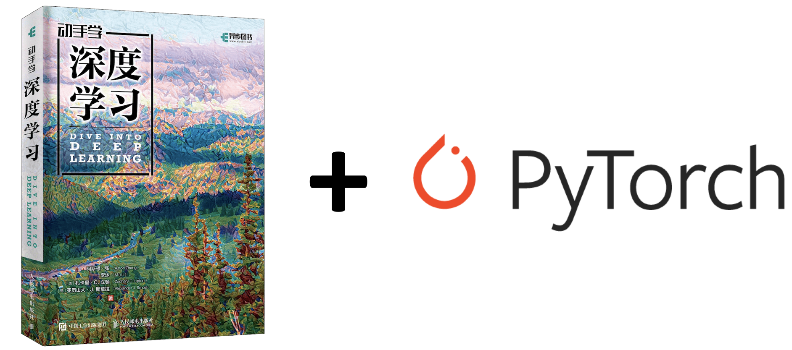

# 如何学习本课程
## 课程简介
- 课程名称：《动手学深度学习-以Pytorch实现》/《Dive into Deep Learning》
- 课程编号：B81
- 所需基础：[Linux](/linux),[Jupyter](/jupyter),[Python](/python3),和一定的概率数理统计基础
- 学习周期：2周（以每天投入2小时左右时间进行学习估算）
- 学习形式：在线互动[课程使用帮助](/aboutus/help.html)
- 面向群体：本项目面向对深度学习感兴趣，尤其是想使用PyTorch进行深度学习的童鞋。本项目并不要求你有任何深度学习或者机器学习的背景知识，你只需了解基础的数学和编程，如基础的线性代数、微分和概率，以及基础的Python编程。
- 考核标准：能理解课程内容，并独立完成课程中的示例和作业
- 学习成果：熟悉PyTorch深度学习框架的用法，可以使用PyTorch框架完成深度学习任务。
- 课程说明：本课程为引用开源电子书[《动手学深度学习》](https://github.com/ShusenTang/Dive-into-DL-PyTorch.git)，并做适当修正以便于在线交互式学习。课程中除GPU外的环境均已配置好，您可在线边实践边学习。



[本项目](https://tangshusen.me/Dive-into-DL-PyTorch)将[《动手学深度学习》](http://zh.d2l.ai/) 原书中MXNet代码实现改为PyTorch实现。原书作者：阿斯顿·张、李沐、扎卡里 C. 立顿、亚历山大 J. 斯莫拉以及其他社区贡献者，GitHub地址：https://github.com/d2l-ai/d2l-zh

此书的[中](https://zh.d2l.ai/)[英](https://d2l.ai/)版本存在一些不同，针对此书英文版的PyTorch重构可参考[这个项目](https://github.com/dsgiitr/d2l-pytorch)。
There are some differences between the [Chinese](https://zh.d2l.ai/) and [English](https://d2l.ai/) versions of this book. For the PyTorch modifying of the English version, you can refer to [this repo](https://github.com/dsgiitr/d2l-pytorch).


## 简介


## 原书地址

中文版：[动手学深度学习](https://zh.d2l.ai/) | [Github仓库](https://github.com/d2l-ai/d2l-zh)       
English Version: [Dive into Deep Learning](https://d2l.ai/) | [Github Repo](https://github.com/d2l-ai/d2l-en)


## 引用

如果您在研究中使用了这个项目请引用原书:

```
@book{zhang2019dive,
    title={Dive into Deep Learning},
    author={Aston Zhang and Zachary C. Lipton and Mu Li and Alexander J. Smola},
    note={\url{http://www.d2l.ai}},
    year={2020}
}
```

## 本课程专用微信学习交流群 


## 相关资料推荐

| 类别 | 名称                                                | 价格 |
| ---- | --------------------------------------------------- | ---- |
| 书籍 | [动手学深度学习](https://item.jd.com/12527061.html) | 84.2 |
