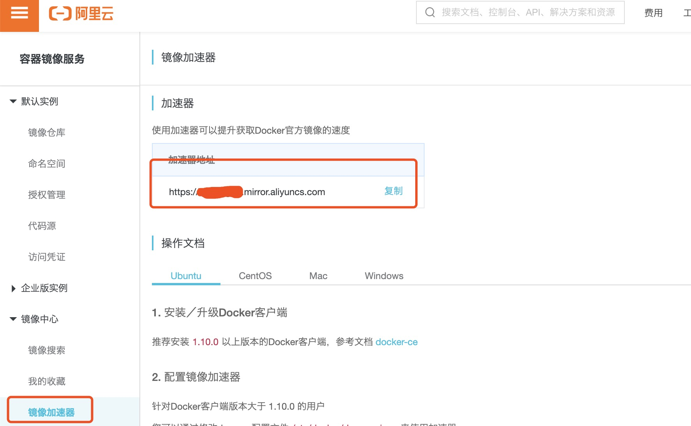

# Docker 镜像加速

国内从 DockerHub 拉取镜像有时会遇到困难，此时可以配置镜像加速器。

Docker 官方和国内很多云服务商都提供了国内加速器服务，例如：

- 网易：**https://hub-mirror.c.163.com/**
- 阿里云：**https://<你的ID>.mirror.aliyuncs.com**

当配置某一个加速器地址之后，若发现拉取不到镜像，请切换到另一个加速器地址。

国内各大云服务商均提供了 Docker 镜像加速服务，建议根据运行 Docker 的云平台选择对应的镜像加速服务。

### 系统的设置

对于使用 systemd 的系统，请在`/etc/docker/daemon.json`中写入如下内容（如果文件不存在请新建该文件）：这里使用网易的加速器。

```bash
cat > /etc/docker/daemon.json <<EOF
{"registry-mirrors":["https://hub-mirror.c.163.com/"]}
EOF
```

之后重新启动服务：

```bash
sudo systemctl daemon-reload
sudo systemctl restart docker
```

### 检查加速器是否生效

检查加速器是否生效配置加速器之后，如果拉取镜像仍然十分缓慢，请手动检查加速器配置是否生效，在命令行执行 **docker info**，如果从结果中看到了如下内容，说明配置成功。

```bash
docker info | grep 163
```

### 获取阿里云镜像加速地址

阿里云镜像获取地址：https://cr.console.aliyun.com/cn-hangzhou/instances/mirrors，登陆后，左侧菜单选中镜像加速器就可以看到你的专属地址了：

