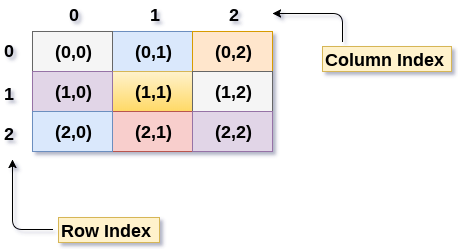
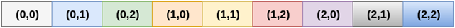
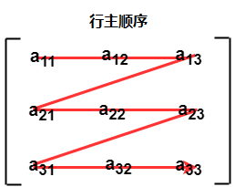
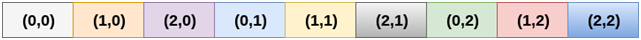
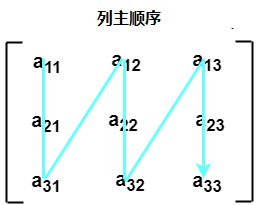

# 二维数组

二维数组可以理解为数组的数组。二维数组组织为矩阵，可以表示为行和列的集合。

但是，创建二维数组以实现关系数据库外观相似的数据结构。它提供了一次容纳大量数据的便利性，可以在任何需要的地方传递给任意数量的功能。

## 如何声明二维数组

声明二维数组的语法与一维数组的语法非常相似，如下所示 - 

```c
int arr[max_rows][max_columns];
```

它产生的数据结构如下所示 - 

上图显示了二维数组，元素以行和列的形式组织。 第一行的第一个元素由`[0][0]`表示，其中第一个索引中显示的数字是行的数字，而第二个索引显示的数字是列的数字。

## 如何访问二维数组的数据

由于二维数组的元素可以随机访问。这与一维数组类似，可以使用单元格的索引访问二维数组中的各个单元格。将两个索引值附加到特定单元格，一个是行号，另一个是列号。

使用以下语法将存储在二维数组的任何特定单元格中的值存储到某个变量`x`。

```c
int x = a[i][j];
```

其中`i`和`j`分别是单元格的行号和列号。使用以下代码将二维数组的每个单元格分配`0`值：

```c
for ( int i=0; i<n ;i++)  
{  
    for (int j=0; j<n; j++)   
    {  
        a[i][j] = 0;   
    }  
}
```

## 3.初始化二维数组

当同时在C语言编程中声明和初始化一维数组时，不需要指定数组的大小。 但是这不适用于二维数组。必须至少定义数组的第二个维度。

声明和初始化二维数组的语法如下 -

```c
int arr[2][2] = {0,1,2,3};
```

二维数组的元素数量总是等于：行数 * 列数 。

**示例：** 将用户数据存储到二维数组并打印。

**C语言的实现**

文件名:array-2d.c

```c
#include <stdio.h>  
void main()
{
    int arr[3][3], i, j;
    for (i = 0;i < 3;i++)
    {
        for (j = 0;j < 3;j++)
        {
            printf("Enter a[%d][%d]: ", i, j);
            scanf("%d", &arr[i][j]);
        }
    }
    printf("\n printing the elements ....\n");
    for (i = 0;i < 3;i++)
    {
        printf("\n");
        for (j = 0;j < 3;j++)
        {
            printf("%d\t", arr[i][j]);
        }
    }
}
```

```bash
gcc /share/lesson/data-structure/array-2d.c && ./a.out
```

康康

## 将二维数组映射到一维数组

在映射二维数组时，大多数人可能会问为什么需要这种映射。创建二维数组和实现关系数据库表看起来有相似的数据结构，在计算机存储器中，二维数组存储技术类似于一维数组的存储技术。

二维数组的大小等于行数和数组中存在的列数的乘积。 确实需要将二维数组映射到一维数组，以便将它们存储在内存中。

一个`3 X 3`的二维数组如下图所示。 但是，需要将此数组映射到一维数组，以便将其存储到内存中。



将二维数组元素存储到存储器中有两种主要技术 - 

#### 行主顺序

在行主排序中，二维数组的所有行连续地存储在存储器中。 考虑一下上图中所示数组，它按行主顺序的存储器分配如下所示 - 



首先，数组的第一行完全存储到存储器中，然后数组的第二行完全存储到存储器中，直到最后一行也完全存储到存储器中。



#### 列主顺序

根据列主排序，二维数组的所有列都连续地存储在存储器中。 上面图像中所示数组的存储器分配给出如下 - 



首先，数组的第一列完全存储到存储器中，然后数组的第二行完全存储到存储器中，直到数组的最后一列。


## 计算二维数组随机元素的地址

由于存在两种不同的将二维数组存储到存储器中的技术，因此也有两种不同的公式来计算二维数组的随机元素的地址。

#### 按行主顺序

如果数组由`a[m][n]`声明，其中`m`是行数，而`n`是列数，则以行主顺序存储的数组的元素`a[i][j]`的地址计算为，

```shell
Address(a[i][j]) = B. A. + (i * n + j) * size
```

其中，`B. A.`是基数地址或数组`a[0][0]`的第一个元素的地址。

示例：

```shell
a[10...30, 55...75], 基地址 array (BA) = 0 , 一个元素的大小 = 4 字节 。
计算 a[15][68] 的地址为 -    

Address(a[15][68]) = 0 +   
((15 ? 10) x (68 ? 55 + 1) + (68 ? 55)) x 4  

= (5 x 14 + 13) x 4  
= 83 x 4   
= 332
```

#### 按列主顺序

如果数组由`a[m][n]`声明，其中`m`是行数，而`n`是列数，则以列主顺序存储的数组的元素`a[i][j]`的地址计算为，

```
Address(a[i][j]) = ((j*m)+i)*Size + BA
```

其中，`BA`是数组的基地址。

**示例**

```
A [-5 ... +20][20 ... 70], BA = 1020, 元素的大小为 = 8 字节。计算 a[0][30] 的位置是 - 

地址 [A[0][30]) = ((30-20) x 24 + 5)  x 8 + 1020   =  245 x 8 + 1020 = 2980 字节
```