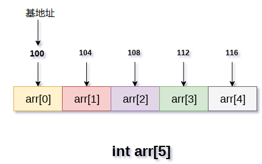

# 数组(array)

**数组的定义**

- 数组是存储在连续内存位置的相似类型数据项的集合。
- 数组是C语言中的派生数据类型，它可存储原始类型的数据，如：`int`，`char`，`double`，`float`等。
- 数组是最简单的数据结构，它的每个数据元素都可以使用索引号随机访问。
- 例如，如果想要将学生的6个科目的分数存储，那么不需要为每个科目的分数定义不同的变量。而是定义一个数组，将每个科目的分数存储在连续内存位置。

数组`marks[10]`定义了`10`个不同科目的学生分数，每个科目分数位于数组的特定下标，即`marks[0]`表示第一个科目的分数，`marks[1]`表示第二个科目的分数等。

## 数组的属性

- 每个元素具有相同的数据类型并且具有相同的大小，即`int = 4`个字节。
- 数组的元素存储在连续的存储器位置，第一个元素存储在最小的存储器位置。
- 数组可以随机访问数组的元素，因为可使用给定的基址和数据元素的大小来计算数组的每个元素的地址。

例如，在C语言中，声明数组的语法如下：

```c
int arr[10]; char arr[10]; 
float arr[5];
```

## 使用数组

在计算机编程中，大多数情况需要存储大量相似类型的数据。 要存储这样的数据量，需要定义大量的变量。 在编写程序时，很难记住所有变量的名称。也没有必要使用不同的名称命名所有变量，最好定义一个数组并将所有元素存储到其中。

下面的示例说明了数组在编写特定问题的代码时如何使用。
在下面的例子中，要记录一个学生六个科目的考试分数。这个问题旨在计算一个学生所有分数的平均值。为了说明数组的重要性，这里创建了两个程序，一个是不使用数组，另一个是使用数组来存储学生的分数。

**不使用数组的程序：**

```c
#include <stdio.h>  
void main ()  
{  
    int marks_1 = 56, marks_2 = 78, marks_3 = 88, marks_4 = 76, marks_5 = 56, marks_6 = 89;   
    float avg = (marks_1 + marks_2 + marks_3 + marks_4 + marks_5 +marks_6) / 6 ;   
    printf("%f", avg);   
}
```

```bash
gcc /share/lesson/data-structure/array1.c && ./a.out
```

康康

**使用数组的程序：**

```c
#include <stdio.h>  
void main ()  
{  
    int marks[6] = {56,78,88,76,56,89};  
    int i;    
    int sum;
    for (i=0; i<6; i++ )   
    {  
        sum = sum + marks[i];   
    }
    float avg = sum / 6;
    printf("%f", avg);   
}
C
```

```bash
gcc /share/lesson/data-structure/array2.c && ./a.out
```

康康

## 数组操作的复杂性

数组操作的时间和空间复杂性在下表中描述。

**时间复杂性**

| 算法 | 平均情况 | 最坏情况 |
| ---- | -------- | -------- |
| 访问 | O(1)     | O(1)     |
| 搜索 | O(n)     | O(n)     |
| 插入 | O(n)     | O(n)     |
| 删除 | O(n)     | O(n)     |

**空间复杂性**
在数组中，最坏情况下的空间复杂度是O(n)。

## 数组的优点

- 数组为同一类型的变量组提供单一名称，因此很容易记住数组中所有元素的名称。
- 遍历数组是一个非常简单的过程，只需要递增数组的基址，就可以逐个访问每个元素。
- 可以使用索引直接访问数组中的任何元素。

## 内存分配数组

如前面所提到的，数组的所有数据元素都存储在主存储器中的连续位置。 数组名称表示主存储器中的基地址或第一个元素的地址。 数组的每个元素都由适当的索引表示。
可以用三种方式定义数组的索引。

- 0(从零开始索引)：数组的第一个元素是`arr[0]`。
- 1(基于一个索引)：数组的第一个元素是`arr [1]`。
- n(基于n的索引)：基于数组的第一个元素，可以定位任何随机索引值。

在下图中，展示了大小为`5`的数组`arr`的内存分配。该数组遵循基于`0`的索引方法。数组的基址是第`100`字节，它将是`arr[0]`的地址。 这里，`int`的大小是`4`个字节，因此每个元素在内存中占用`4`个字节。


在基于`0`的索引中，如果数组的大小是`n`，那么它是最大索引号，则最后一个元素使用`n-1`来访问。 但是，如果使用基于`1`的索引，那么它的最大索引值将是`n`。

## 访问数组的元素

要访问数组的任何随机元素，需要以下信息：

- 数组的基址。
- 元素的大小(以字节为单位)。
- 数组的索引类型。

可以使用以下公式计算一维数组的元素地址：

```
 A[i] 元素的字节地址  = 基地址 + size * ( i - 第1个索引)
```

**伪代码示例：**

```shell
在数组中, A[-10 ..... +2 ], 基地址 (BA) = 999, 元素的大小 = 2 字节,   
找出 A[-1] 的位置如下 -   
L(A[-1]) = 999 + [(-1) - (-10)] x 2  
       = 999 + 18   
       = 1017
```

## 将数组传递给函数

如前面提到的那样，数组的名称代表数组第一个元素地址或数组的起始地址。 可以使用基址遍历数组的所有元素。

以下示例说明了如何将数组传递给函数。

**示例：**

文件名:array3.c

```c
#include <stdio.h>  
int summation(int[]);  
void main ()  
{  
    int arr[5] = {0,1,2,3,4};  
    int sum = summation(arr);   
    printf("%d",sum);   
}   

int summation (int arr[])   
{  
    int sum=0,i;   
    for (i = 0; i<5; i++)   
    {  
        sum = sum + arr[i];   
    }   
    return sum;   
}
```

```bash
gcc /share/lesson/data-structure/array3.c && ./a.out
```

康康