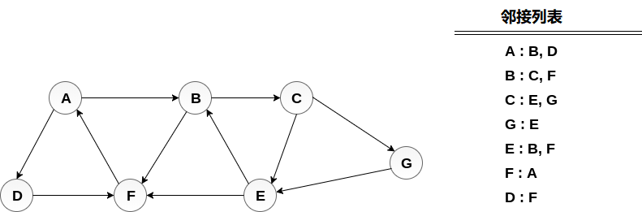

# 图 广度优先搜索算法(bfs)

在本教程的这一部分中，将讨论使用哪些技术，可以遍历图的所有顶点。
遍历图表表示访问图的所有节点和顶点。 使用两种标准方法，可以遍历图。接下来将详细讨论它们中。

- 广度优先搜索
- 深度优先搜索

## 1. 广度优先搜索(BFS)算法

广度优先搜索是一种图遍历算法，它从根节点开始遍历图并探索所有相邻节点。 然后，它选择最近的节点并浏览所有未探测的节点。 对于每个最近的节点，该算法遵循相同的过程，直到找到目标为止。

下面给出了广度优先搜索的算法。算法从检查节点A及其所有邻居开始。在下一步中，搜索`A`的最近节点的邻居，并且在后续步骤中继续处理。 该算法探索所有节点的所有邻居，并确保每个节点只访问一次，并且没有访问任何节点两次。

**算法**

```
第1步：设置状态 = 1(就绪状态)
    对于G中的每个节点
第2步：将起始节点A排队
    并设置其状态 = 2
    (等待状态)
第3步：重复第4步和第5步，直到
    队列是空的
第4步：使节点N出列。处理它
    并设置其状态 = 3
    (处理状态)。
第5步：将所有邻居排队
      N处于就绪状态
 (其STATUS = 1)并设置它们状态 = 2
 (等待状态)
  [循环结束]
第6步：退出
```

**示例**

考虑下图中显示的图G，计算从节点`A`到节点`E`的最小路径`p`。给定每条边的长度为`1`。



**解答：**

最小路径`P`可以通过应用广度优先搜索算法找到，该算法将从节点`A`开始并将以`E`结束。算法使用两个队列，即`QUEUE1`和`QUEUE2`。 `QUEUE1`保存要处理的所有节点，而`QUEUE2`保存从`QUEUE1`处理和删除的所有节点。

下面来看看节点**A** 中的图。

1. 将

   ```
   A
   ```

   添加到

   ```
   QUEUE1
   ```

   ，将

   ```
   NULL
   ```

   添加到

   ```
   QUEUE2
   ```

   。

   ```
   QUEUE1 = {A}  
   QUEUE2 = {NULL}
   ```

2. 从`QUEUE1`中删除节点`A`并插入其所有邻居，将节点`A`插入`QUEUE2`。

   ```
   QUEUE1 = {B, D}  
   QUEUE2 = {A}
   ```

3. 从`QUEUE1`中删除节点`B`并插入其所有邻居。 将节点`B`插入`QUEUE2`。

   ```
   QUEUE1 = {D, C, F}   
   QUEUE2 = {A, B}
   ```

4. 从`QUEUE1`中删除节点`D`并插入其所有邻居。 由于`F`是已插入的唯一邻居，因此不会再插入它。 将节点`D`插入`QUEUE2`。

```
QUEUE1 = {C, F}  
QUEUE2 = { A, B, D}
```

1. 从`QUEUE1`中删除节点`C`并插入其所有邻居。 将节点`C`添加到`QUEUE2`。

   ```
   QUEUE1 = {F, E, G}  
   QUEUE2 = {A, B, D, C}
   ```

2. 从`QUEUE1`中删除`F`并添加其所有邻居。由于已经添加了所有邻居，不会再添加它们。 将节点`F`添加到`QUEUE2`。

```
QUEUE1 = {E, G}  
QUEUE2 = {A, B, D, C, F}
```

1. 从`QUEUE1`中删除`E`，所有`E`的邻居都已添加到`QUEUE1`，因此不会再添加它们。 访问所有节点，并且目标节点即`E`遇到`QUEUE2`。

```
QUEUE1 = {G}  
QUEUE2 = {A, B, D, C, F,  E}
```

现在，使用`QUEUE2`中可用的节点从`E`回溯到`A`。

最小路径为：A→B→C→E。