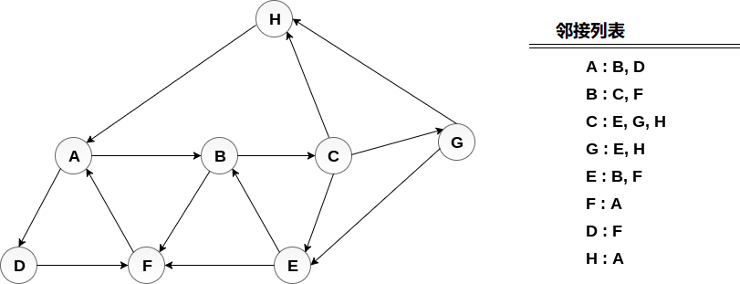

# 图 深度优先搜索算法(dfs)	

深度优先搜索(DFS)算法从图`G`的初始节点开始，然后越来越深，直到找到目标节点或没有子节点的节点。该算法然后从死角回溯到尚未完全未探索的最新节点。

在DFS中使用的数据结构是堆栈。该过程类似于`BFS`算法。 在DFS中，通向未访问节点的边称为发现边，而通向已访问节点的边称为块边。

**算法**

```
第1步：为G中的每个节点设置STATUS = 1(就绪状态)
第2步：将起始节点A推入堆栈并设置其STATUS = 2(等待状态)
第3步：重复第4步和第5步，直到STACK为空
第4步：弹出顶部节点N.处理它并设置其STATUS = 3(处理状态)
第5步：将处于就绪状态(其STATUS = 1)的N的所有邻居推入堆栈并设置它们
    STATUS = 2(等待状态)
    [循环结束]
第6步：退出
```

**示例：**

考虑图G及其邻接列表，如下图所示。 通过使用深度优先搜索(DFS)算法计算从节点`H`开始打印图的所有节点的顺序。


**方案：**
将`H` 推入堆栈 - 

```
STACK : H
```

弹出是堆栈的顶部元素，即`H`，打印它并将`H`的所有邻居推送到处于就绪状态的堆栈上。

```
Print H   
STACK : A
```

弹出堆栈的顶部元素，即`A`，打印它并将`A`的所有邻居推入堆栈中处于就绪状态。

```
Print A  
Stack : B, D
```

弹出堆栈的顶部元素，即`D`，打印它并将`D`的所有邻居推入处于就绪状态的堆栈。

```
Print D   
Stack : B, F
```

弹出堆栈的顶部元素，即`F`，打印它并将F的所有邻居推入处于就绪状态的堆栈。

```
Print F  
Stack : B
```

弹出堆栈的顶部，即`B`并推送所有邻居。

```
Print B   
Stack : C
```

弹出堆栈的顶部，即`C`并推送所有邻居。

```
Print C   
Stack : E, G
```

弹出堆栈的顶部，即`G`并推送其所有邻居。

```
Print G  
Stack : E
```

弹出堆栈的顶部，即`E`并推送其所有邻居。

```
Print E  
Stack :
```

因此，堆栈现在变为空，并且遍历了图的所有节点。

图表的打印顺序为：

```
H → A → D → F → B → C → G → E
```