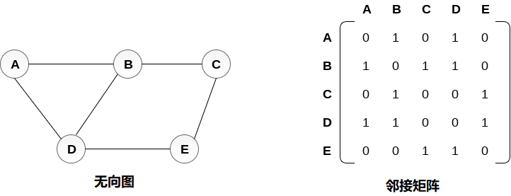
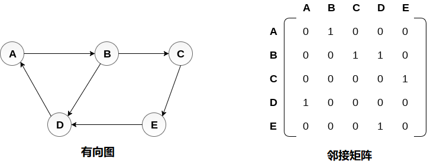
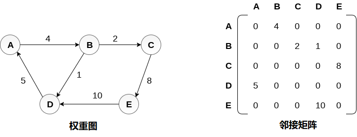
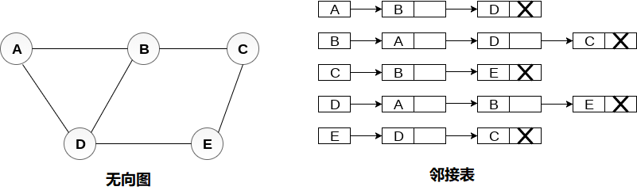
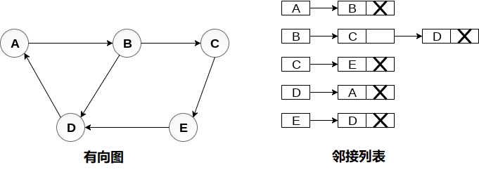
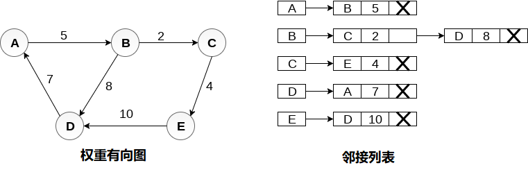

# 图的表示

图的表示是指用于将某些图存储到计算机内存中的技术。

有两种方法可以将图存储到计算机的内存中。在本教程的这一部分中，将详细讨论它们。

## 顺序表示

在顺序表示中，使用邻接矩阵来存储由顶点和边表示的映射。在邻接矩阵中，行和列由图顶点表示。 具有`n`个顶点的图将具有尺寸`n×n`。

如果在`Vi`和`Vj`之间存在边缘，则无向图`G`的邻接矩阵表示中的项目`Mij`将为`1`。

无向图及其邻接矩阵表示如下图所示。

在上图中，可以看到顶点`(A，B，C，D，E)`之间的映射是通过使用也在图中示出的邻接矩阵来表示的。

对于有向图和无向图存在不同的邻接矩阵。 在有向图中，只有当存在从`Vi`指向`Vj`的边时，条目`Aij`才为`1`。

有向图及其邻接矩阵表示如下图所示。

权重有向图的表示是不同的。 不是通过`1`填充条目，而是通过各个边的权重来表示邻接矩阵的非零条目。

权重有向图以及邻接矩阵表示如下图所示。

## 链接表示

在链接表示中，邻接列表用于将图存储到计算机的内存中。考虑下图中显示的无向图并检查邻接列表表示。

要为图中存在的每个节点维护邻接列表，邻接列表将节点值和指向下一个相邻节点的指针存储到相应节点。 如果遍历所有相邻节点，则将`NULL`存储在列表的最后一个节点的指针字段中。 邻接列表的长度之和等于无向图中存在的边数的两倍。

考虑下图中显示的有向图，并查看图的邻接列表表示。

在有向图中，所有邻接列表的长度之和等于图中存在的边的数量。

在加权有向图的情况下，每个节点包含一个额外的字段，称为节点的权重。 有向图的邻接列表表示如下图所示。

