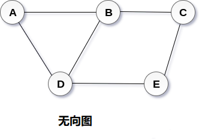
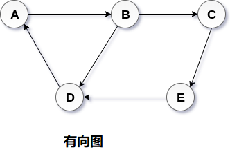

# 图

图可以定义为用于连接这些顶点的顶点和边的组。 图可以看作是循环树，图中顶点(节点)维持它们之间的任何复杂关系，而不是简单的父子关系。

## 图定义

图**G** 可以定义为有序集`G(V，E)`，其中`V(G)`表示顶点集，`E(G)`表示用于连接这些顶点的边集。

图`G(V，E)`有`5`个顶点`(A，B，C，D，E)`和6个边`((A，B)，(B，C)，(C，E)，(E，D)， (D，B)，(D，A))`如下图所示。

## 有向图和无向图

图可以是有向的或无向的。 但是，在无向图中，边与它们的方向无关。 上图中显示了无向图，因为其边未与任何方向相连。 如果在顶点`A`和`B`之间存在边，则顶点可以从`B`遍历到`A`以及从`A`到`B`遍历。

在有向图中，边形成有序对。 边表示从某个顶点A到另一个顶点`B`的特定路径。节点`A`称为初始节点，而节点`B`称为终端节点。

有向图如下图所示。

## 图技术

#### 路径

可以将路径定义为遵循的节点序列，以便从初始节点`U`到达某个终端节点`V`。

#### 闭合路径

如果初始节点与终端节点相同，则将路径称为闭合路径。 如果`V0 = VN`，则路径将是闭合路径。

#### 简单路径

如果图的所有节点都是异常的并且异常`V0 = VN`，那么这种路径`P`被称为闭合简单路径。

#### 周期

周期可以定义为除了第一个和最后一个顶点之外没有重复边或顶点的路径。

#### 连通图

连通图是在`V`中的每两个顶点`(u，v)`之间存在一些路径的图。连通图中没有孤立的节点。

#### 完整图

完整图是每个节点与所有其他节点连接的图。 完整图包含`n(n-1/2`个边，其中`n`是图中节点的数量。

#### 权重图

在权重图中，为每个边分配一些数据，例如长度或重量。 边`e`的权重可以给定为`w(e)`，其必须是指示穿过边缘的成本的正(+)值。

####  有向图

有向图是有向图，其中图的每个边与某个方向相关联，并且只能在指定的方向上进行遍历。

#### 循环

与类似端点相关联的边可以称为循环。

#### 相邻节点

如果两个节点`u`和`v`通过边`e`连接，则节点`u`和`v`被称为邻居或相邻节点。

####  节点的度

节点的度数是与该节点连接的边的数量。 度为`0`的节点称为隔离节点。