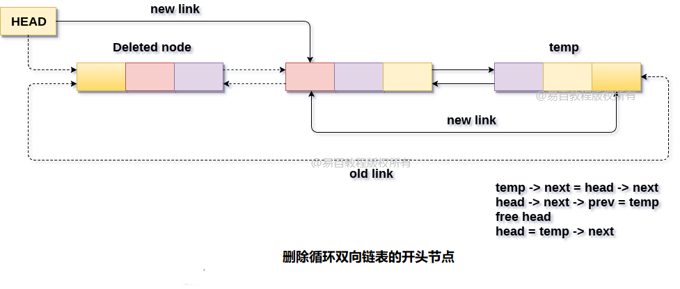

# 双向循环链表 删除开头节点

删除循环双向链表中的第一个节点，有两种情况。

在第一种情况下，要删除的节点是链表中存在的唯一节点。在这种情况下，条件`head->next == head`将为`true`，因此需要完全删除列表。

通过将链表的头指针指定为`null`并释放头指针来简单地完成。

```c
head = NULL;   
free(head);
```

**在第二种情况下**，链表包含有多个元素(节点)，因此条件`head->next == head`将变为`false`。到达链表的最后一个节点并在那里进行一些指针调整。使用`while`循环到达最后一个节点。

```c
temp = head;   
while(temp -> next != head)  
{  
    temp = temp -> next;  
}
```

现在，`temp`将指向链表的最后一个节点。 需要删除链表的第一个节点，即由头(`head`)指针指向的节点。 因此，最后一个节点必须包含现有头节点的`next`指针所指向的节点的地址。 为此，请使用以下语句。

```c
temp -> next = head -> next;
```

新的头节点，即现有头节点的下一个节点也必须通过其`prev`指针指向链表的最后一个节点。 为此，请使用以下语句。

```c
head -> next -> prev = temp;
```

现在，释放头指针并使其下一个指针成为链表的新头节点。

```c
free(head);  
head = temp -> next;
```

以这种方式，就可以从循环双向链表中删除开头节点。

**算法**

```
第1步：IF HEAD = NULL
    提示内存溢出
    转到第8步
    [IF结束]

第2步：设置TEMP = HEAD
第3步：在TEMP - > NEXT！= HEAD时重复第4步
第4步：设置TEMP = TEMP - > NEXT
    [循环结束]

第5步：设置TEMP - > NEXT = HEAD - > NEXT
第6步：设置HEAD - > NEXT - > PREV = TEMP
第7步：释放HEAD
第8步：SET HEAD = TEMP - > NEXT
```

**示意图如下所示** 



## C语言实现的示例代码

文件名:linked-list-double-circular-deletion-at-head.c

```c
#include<stdio.h>  
#include<stdlib.h>  
void create(int);
void deletion_beginning();
struct node
{
    int data;
    struct node *next;
    struct node *prev;
};
struct node *head;
void main()
{
    int choice, item, choice1;
    do
    {
        printf("1.Append List\n2.Delete Node from beginning\n3.Exit\n4.Enter your choice?");
        scanf("%d", &choice);
        switch (choice)
        {
        case 1:
            printf("Enter the item\n");
            scanf("%d", &item);
            create(item);
            break;
        case 2:
            deletion_beginning();
            break;
        case 3:
            exit(0);
            break;
        default:
            printf("Please Enter valid choice\n");
        }

    } while (choice != 3);
}
void create(int item)
{
    struct node *ptr = (struct node *) malloc(sizeof(struct node));
    struct node *temp;
    if (ptr == NULL)
    {
        printf("OVERFLOW\n");
    }
    else
    {
        ptr->data = item;
        if (head == NULL)
        {
            head = ptr;
            ptr->next = head;
            ptr->prev = head;
        }
        else
        {
            temp = head;
            while (temp->next != head)
            {
                temp = temp->next;
            }
            temp->next = ptr;
            ptr->prev = temp;
            head->prev = ptr;
            ptr->next = head;
        }
    }
    printf("Node Inserted\n");
}
void deletion_beginning()
{
    struct node *temp;
    if (head == NULL)
    {
        printf("UNDERFLOW\n");
    }
    else if (head->next == head)
    {
        head = NULL;
        free(head);
        printf("Node Deleted\n");
    }
    else
    {
        temp = head;
        while (temp->next != head)
        {
            temp = temp->next;
        }
        temp->next = head->next;
        head->next->prev = temp;
        free(head);
        head = temp->next;
        printf("Node Deleted\n");
    }

}
```

```bash
gcc /share/lesson/data-structure/linked-list-double-circular-deletion-at-head.c && ./a.out
```

康康