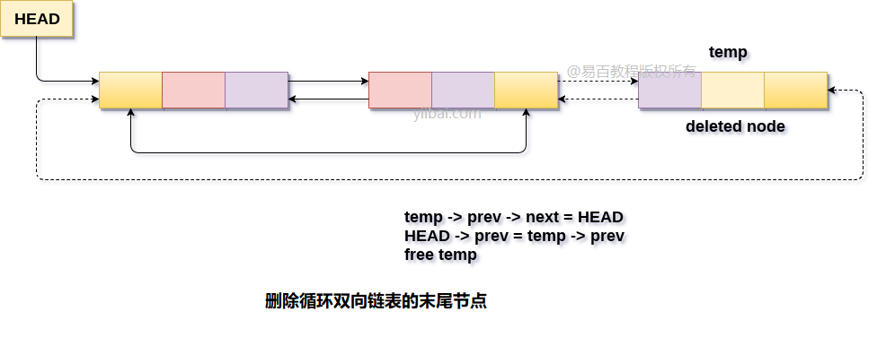

# 双向循环链表 删除末尾节点 			

要删除循环双向链表中的末尾节点，有两种情况。

**第一种情况**，要删除的节点可以是链表中唯一存在的节点。在这种情况下，条件`head->next == head`将变为`true`，因此需要完全删除链表。

通过将链表的头(`head`)指针指定为`null`并释放头指针来简单地完成。

```c
head = NULL;   
free(head);
```

**在第二种情况**，链表包含多个元素，因此条件`head->next == head`将变为`false`。 现在，到达链表的最后一个节点并在那里进行一些指针调整。 为此目的可以使用`while`循环。

```c
temp = head;   
while(temp -> next != head)  
{  
    temp = temp -> next;  
}
```

现在，`temp`将指向要在链表中删除的节点。 创建上一个`temp`节点的下一个指针，指向链表的头节点。

```c
temp -> prev -> next = head;
```

使头节点的`prev`指针指向`temp`的`prev`节点。

```c
head -> prev = ptr -> prev;
```

接下来，释放`temp`指针以释放节点占用的内存。

```c
free(head)
```

以这种方式，就可以删除链表的最后一个节点。

**算法**

```
第1步：IF HEAD = NULL
    提示内存溢出
    转到第8步
    [IF结束]

第2步：设置TEMP = HEAD
第3步：在TEMP - > NEXT！= HEAD时重复第4步
第4步：设置TEMP = TEMP - > NEXT
[循环结束]

第5步：设置TEMP - > PREV - > NEXT = HEAD
第6步：SET HEAD - > PREV = TEMP - > PREV
第7步：释放 TEMP
第8步：退出
```

**示意图**



## C语言实现的示例代码

文件名:linked-list-double-circular-deletion-at-tail.c

```c
#include<stdio.h>  
#include<stdlib.h>  
void create(int);
void deletion_last();
struct node
{
    int data;
    struct node *next;
    struct node *prev;
};
struct node *head;
void main()
{
    int choice, item;
    do
    {
        printf("1.Append List\n2.Delete Node from last\n3.Exit\n4.Enter your choice?");
        scanf("%d", &choice);
        switch (choice)
        {
        case 1:
            printf("Enter the item\n");
            scanf("%d", &item);
            create(item);
            break;
        case 2:
            deletion_last();
            break;
        case 3:
            exit(0);
            break;
        default:
            printf("Please Enter valid choice\n");
        }

    } while (choice != 3);
}
void create(int item)
{
    struct node *ptr = (struct node *) malloc(sizeof(struct node));
    struct node *temp;
    if (ptr == NULL)
    {
        printf("OVERFLOW\n");
    }
    else
    {
        ptr->data = item;
        if (head == NULL)
        {
            head = ptr;
            ptr->next = head;
            ptr->prev = head;
        }
        else
        {
            temp = head;
            while (temp->next != head)
            {
                temp = temp->next;
            }
            temp->next = ptr;
            ptr->prev = temp;
            head->prev = ptr;
            ptr->next = head;
        }
    }
    printf("Node Inserted\n");
}
void deletion_last()
{
    struct node *ptr;
    if (head == NULL)
    {
        printf("UNDERFLOW\n");
    }
    else if (head->next == head)
    {
        head = NULL;
        free(head);
        printf("Node Deleted\n");
    }
    else
    {
        ptr = head;
        if (ptr->next != head)
        {
            ptr = ptr->next;
        }
        ptr->prev->next = head;
        head->prev = ptr->prev;
        free(ptr);
        printf("Node Deleted\n");
    }
}
```

```bash
gcc /share/lesson/data-structure/linked-list-double-circular-deletion-at-tail.c && ./a.out
```

康康