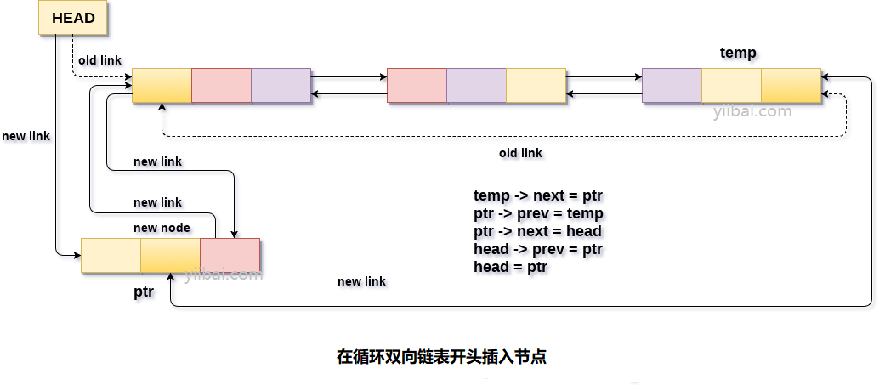

# 双向循环链表 在开头插入节点

在循环双向链表的开头插入节点有两种情况。 链表为空或链表中包含多个元素。

使用以下语句为新节点`ptr`分配内存空间。

```c
ptr = (struct node *)malloc(sizeof(struct node));
```

在第一种情况下，条件`head == NULL`变为`true`，因此该节点将被添加为链表中的第一个节点。此新添加节点的`prev`和`next`指针将仅指向自身。 这可以通过使用以下语句来完成。

```c
head = ptr;  
ptr -> next = head;   
ptr -> prev = head;
```

在第二种情况下，条件`head == NULL`变为`false`。 在这种情况下，需要在链表的末尾进行一些指针调整。 为此，需要通过遍历链表来到达链表的最后一个节点。 遍历链表可以使用以下语句完成。

```c
temp = head;   
while(temp -> next != head)  
{  
    temp = temp -> next;   
}
```

在循环结束时，指针`temp`将指向链表的最后一个节点。 由于要插入的节点将是链表的第一个节点，因此`temp`需要将新节点`ptr`的地址包含在其下一部分中。 可以使用以下语句完成所有指针调整。

```c
temp -> next = ptr;  
ptr -> prev = temp;  
head -> prev = ptr;  
ptr -> next = head;  
head = ptr;
```

以这种方式，新节点插入链表的开头。 该算法及其C语言实现如下。

**算法**

```
第1步：IF PTR = NULL
    提示：内存溢出
    转到第13步
    [IF结束]

第2步：设置NEW_NODE = PTR
第3步：SET PTR = PTR - > NEXT
第4步：设置NEW_NODE - > DATA = VAL
第5步：设置TEMP = HEAD
第6步：在TEMP - > NEXT！= HEAD 时重复第7步
第7步：SET TEMP = TEMP - > NEXT
[循环结束]

第8步：设置TEMP - > NEXT = NEW_NODE
第9步：设置NEW_NODE - > PREV = TEMP
第10步：设置NEW_NODE - > NEXT = HEAD
第11步：SET HEAD - > PREV = NEW_NODE
第12步：SET HEAD = NEW_NODE
第13步：退出
```

**示意图**



## C语言实现示例代码

文件名:linked-list-double-circular-insertion-at-head.c

```c
#include<stdio.h>  
#include<stdlib.h>  
void beg_insert(int);
struct node
{
    int data;
    struct node *next;
    struct node *prev;
};
struct node *head;
void main()
{
    int choice, item;
    do
    {
        printf("Enter the item which you want to insert?\n");
        scanf("%d", &item);
        beg_insert(item);
        printf("Press 0 to insert more ?\n");
        scanf("%d", &choice);
    } while (choice == 0);
}
void beg_insert(int item)
{
    struct node *ptr = (struct node *)malloc(sizeof(struct node));
    struct node *temp;
    if (ptr == NULL)
    {
        printf("OVERFLOW");
    }
    else
    {
        ptr->data = item;
        if (head == NULL)
        {
            head = ptr;
            ptr->next = head;
            ptr->prev = head;
        }
        else
        {
            temp = head;
            while (temp->next != head)
            {
                temp = temp->next;
            }
            temp->next = ptr;
            ptr->prev = temp;
            head->prev = ptr;
            ptr->next = head;
            head = ptr;
        }
        printf("Node Inserted");
    }
}
```

```bash
gcc /share/lesson/data-structure/linked-list-double-circular-insertion-at-head.c && ./a.out
```

康康