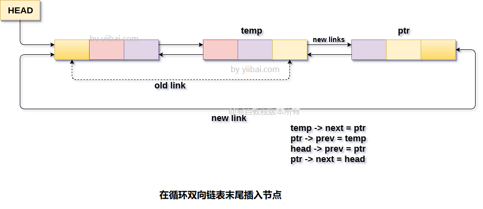

# 双向循环链表 在末尾插入节点 			

在循环双向链表的末尾插入节点有两种情况。 链表为空或链表中包含多个元素。

使用以下语句为新节点`ptr`分配内存空间。

```c
ptr = (struct node *)malloc(sizeof(struct node));
```

在第一种情况下，条件`head == NULL`变为`true`，因此该节点将被添加为链表中的第一个节点。 此新添加节点的下一个(`next`)和上一个(`prev`)指针将仅指向自身。 这可以通过使用以下语句来完成。

```c
head = ptr;  
ptr -> next = head;   
ptr -> prev = head;
```

在第二种情况下，条件`head == NULL`变为`false`，因此节点将被添加为链表中的最后一个节点。 为此，需要在链表末尾进行一些指针调整。 因为，新节点将包含链表的第一个节点的地址，因此需要使最后一个节点的`next`指针指向链表的头(`head`)节点。 类似地，(`head`)节点的`prev`指针也将指向链表的新的最后一个节点。

```c
head -> prev = ptr;  
ptr -> next = head;
```

现在，还需要使链表的最后一个节点的`next`指针指向链表的新的最后一个节点，类似地，新的最后一个节点也将指向`temp`的先前指针。 这将通过使用以下语句来完成。

```c
temp->next = ptr;  
ptr ->prev=temp;
```

这样，新节点`ptr`已作为链表的最后一个节点插入。 该算法及其C语言实现描述如下。

**算法**

```
第1步：IF PTR = NULL
    提示 内存溢出
    转到第12步
[IF结束]

第2步：设置NEW_NODE = PTR
第3步：SET PTR = PTR - > NEXT
第4步：设置NEW_NODE - > DATA = VAL
第5步：设置NEW_NODE - > NEXT = HEAD
第6步：设置TEMP = HEAD
第7步：在TEMP - > NEXT！= HEAD时重复第8步
第8步：SET TEMP = TEMP - > NEXT
[循环结束]

第9步：设置TEMP - > NEXT = NEW_NODE
第10步：设置NEW_NODE - > PREV = TEMP
第11步：SET HEAD - > PREV = NEW_NODE
第12步：退出
```

**示意图**


## C语言实现的示例代码

文件名:linked-list-double-circular-insertion-at-tail.c

```c
#include<stdio.h>  
#include<stdlib.h>  
void insertion_last(int);
struct node
{
    int data;
    struct node *next;
    struct node *prev;
};
struct node *head;
void main()
{
    int choice, item;
    do
    {
        printf("Enter the item which you want to insert?\n");
        scanf("%d", &item);
        insertion_last(item);
        printf("Press 0 to insert more ?\n");
        scanf("%d", &choice);
    } while (choice == 0);
}
void insertion_last(int item)
{
    struct node *ptr = (struct node *) malloc(sizeof(struct node));
    struct node *temp;
    if (ptr == NULL)
    {
        printf("OVERFLOW");
    }else
    {
        ptr->data = item;
        if (head == NULL)
        {
            head = ptr;
            ptr->next = head;
            ptr->prev = head;
        }
        else
        {
            temp = head;
            while (temp->next != head)
            {
                temp = temp->next;
            }
            temp->next = ptr;
            ptr->prev = temp;
            head->prev = ptr;
            ptr->next = head;
        }
    }
    printf("Node Inserted\n");
}
```

```bash
gcc /share/lesson/data-structure/linked-list-double-circular-insertion-at-tail.c && ./a.out
```

康康