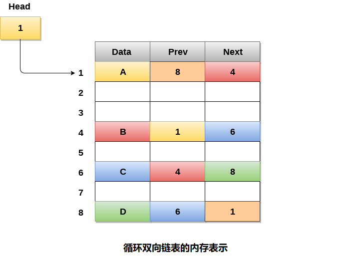

# 双向循环链表

循环双向链表是一种更复杂的数据结构类型，它的节点包含指向其前一节点以及下一节点的指针。 循环双向链表在任何节点中都不包含`NULL`。 链表的最后一个节点包含列表的第一个节点的地址。 链表的第一个节点还包含的前一个指针是指向最后一个节点的地址。

循环双向链表如下图所示 -


由于循环双向链表在其结构中包含三个部分，因此每个节点需要更多空间和更昂贵的基本操作。 但是，循环双向链表提供了对指针更方便的操作，搜索效率提高了两倍。

## 循环双向链表的内存管理

下图显示了为循环双向链表分配内存的方式。 变量`head`包含链表的第一个元素的地址，即地址`1`，因此链表的起始节点包含数据`A`存储在地址`1`中。因此，链表的每个节点应该具有三个部分，起始节点包含最后一个(也是前一个)节点的地址，即`8`和下一个节点，即`4`。链表的最后一个节点，存储在地址`8`并包含数据`6`，包含链表的第一个节点的地址，如图中所示，即地址`1`。在循环双向链表中，最后一个节点由第一个节点的地址标识，该节点存储在最后一个节点的`next`中，因此包含第一个节点地址的节点实际上是该节点的最后一个节点。



## 循环双向链表的操作

可以在循环双链表上执行各种操作。循环双链表的节点结构类似于双向链表。 但是，循环双向链表上的操作如下表所述。

| 编号 | 操作                                                         | 描述                           |
| ---- | ------------------------------------------------------------ | ------------------------------ |
| 1    | [在开头插入节点](./linked-list-double-circular-insertion-at-head.html) | 在循环双向链表的开头添加节点。 |
| 2    | [在末尾插入节点](./linked-list-double-circular-insertion-at-tail.html) | 在循环双向链表的末尾添加节点。 |
| 3    | [删除开头节点](./linked-list-double-circular-deletion-at-head.html) | 删除循环双向链表开头的节点。   |
| 4    | [删除末尾节点](./linked-list-double-circular-deletion-at-tail.html) | 删除循环双向链表末尾的节点。   |

在循环双向链表中遍历和搜索类似于循环单链表中的遍历和搜索，因此不再说明。


## C语言实现的示例代码

文件名:linked-list-double-circular.c

```c
#include<stdio.h>  
#include<stdlib.h>  
struct node
{
    struct node *prev;
    struct node *next;
    int data;
};
struct node *head;
void insertion_beginning();
void insertion_last();
void deletion_beginning();
void deletion_last();
void display();
void search();
void main()
{
    int choice = 0;
    while (choice != 9)
    {
        printf("*********Main Menu*********\n");
        printf("Choose one option from the following list ...\n");
        printf("===============================================\n");
        printf("1.Insert in Beginning\n2.Insert at last\n");
        printf("3.Delete from Beginning\n4.Delete from last\n");
        prinft("5.Search\n6.Show\n7.Exit\n");
        printf("Enter your choice?\n");
        scanf("\n%d", &choice);
        switch (choice)
        {
        case 1:
            insertion_beginning();
            break;
        case 2:
            insertion_last();
            break;
        case 3:
            deletion_beginning();
            break;
        case 4:
            deletion_last();
            break;
        case 5:
            search();
            break;
        case 6:
            display();
            break;
        case 7:
            exit(0);
            break;
        default:
            printf("Please enter valid choice..");
        }
    }
}
void insertion_beginning()
{
    struct node *ptr, *temp;
    int item;
    ptr = (struct node *)malloc(sizeof(struct node));
    if (ptr == NULL)
    {
        printf("OVERFLOW");
    }
    else
    {
        printf("Enter Item value");
        scanf("%d", &item);
        ptr->data = item;
        if (head == NULL)
        {
            head = ptr;
            ptr->next = head;
            ptr->prev = head;
        }
        else
        {
            temp = head;
            while (temp->next != head)
            {
                temp = temp->next;
            }
            temp->next = ptr;
            ptr->prev = temp;
            head->prev = ptr;
            ptr->next = head;
            head = ptr;
        }
        printf("Node inserted\n");
    }

}
void insertion_last()
{
    struct node *ptr, *temp;
    int item;
    ptr = (struct node *) malloc(sizeof(struct node));
    if (ptr == NULL)
    {
        printf("OVERFLOW");
    }
    else
    {
        printf("Enter value");
        scanf("%d", &item);
        ptr->data = item;
        if (head == NULL)
        {
            head = ptr;
            ptr->next = head;
            ptr->prev = head;
        }
        else
        {
            temp = head;
            while (temp->next != head)
            {
                temp = temp->next;
            }
            temp->next = ptr;
            ptr->prev = temp;
            head->prev = ptr;
            ptr->next = head;
        }
    }
    printf("node inserted\n");
}

void deletion_beginning()
{
    struct node *temp;
    if (head == NULL)
    {
        printf("UNDERFLOW");
    }
    else if (head->next == head)
    {
        head = NULL;
        free(head);
        printf("node deleted\n");
    }
    else
    {
        temp = head;
        while (temp->next != head)
        {
            temp = temp->next;
        }
        temp->next = head->next;
        head->next->prev = temp;
        free(head);
        head = temp->next;
    }

}
void deletion_last()
{
    struct node *ptr;
    if (head == NULL)
    {
        printf("UNDERFLOW");
    }
    else if (head->next == head)
    {
        head = NULL;
        free(head);
        printf("node deleted\n");
    }
    else
    {
        ptr = head;
        if (ptr->next != head)
        {
            ptr = ptr->next;
        }
        ptr->prev->next = head;
        head->prev = ptr->prev;
        free(ptr);
        printf("node deleted\n");
    }
}

void display()
{
    struct node *ptr;
    ptr = head;
    if (head == NULL)
    {
        printf("nothing to print");
    }
    else
    {
        printf("printing values ... \n");

        while (ptr->next != head)
        {

            printf("%d\n", ptr->data);
            ptr = ptr->next;
        }
        printf("%d\n", ptr->data);
    }

}

void search()
{
    struct node *ptr;
    int item, i = 0, flag = 1;
    ptr = head;
    if (ptr == NULL)
    {
        printf("Empty List\n");
    }
    else
    {
        printf("Enter item which you want to search?\n");
        scanf("%d", &item);
        if (head->data == item)
        {
            printf("item found at location %d", i + 1);
            flag = 0;
        }
        else
        {
            while (ptr->next != head)
            {
                if (ptr->data == item)
                {
                    printf("item found at location %d ", i + 1);
                    flag = 0;
                    break;
                }
                else
                {
                    flag = 1;
                }
                i++;
                ptr = ptr->next;
            }
        }
        if (flag != 0)
        {
            printf("Item not found\n");
        }
    }

}
```

```bash
gcc /share/lesson/data-structure/linked-list-double-circular.c && ./a.out
```

康康