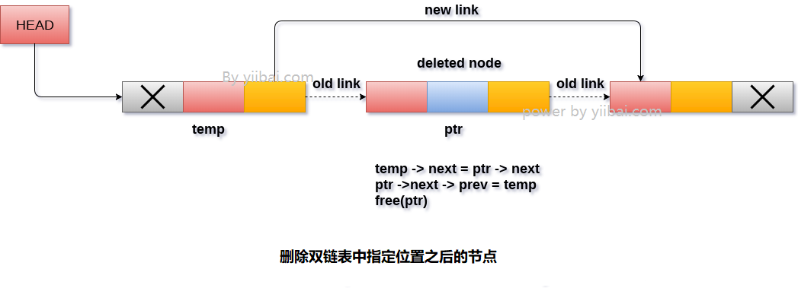

# 双向链表 删除指定节点之后的节点

要删除双向链表中指定数据之后节点，需要执行以下步骤。

- 将头指针复制到临时指针

  ```
  temp
  ```

  。

  ```c
  temp = head;
  C
  ```

- 遍历链表，直到找到所需的数据值。

  ```c
  while(temp -> data != val){
    temp = temp -> next;  
  }
  ```

- 检查它是否是链表的最后一个节点。 如果是，那么就无法执行删除。

  ```c
  if(temp -> next == NULL)
  {  
    return;
  }
  ```

- 检查要删除的节点是否是链表的最后一个节点，如果是，那么需要使该节点的下一个指针指向

  ```
  null
  ```

  ，以便它是链表新的最后一个节点。

  ```c
  if(temp -> next -> next == NULL)  
  {  
    temp ->next = NULL;  
  }
  ```

- 否则，使指针

  ```
  ptr
  ```

  指向要删除的节点。 让

  ```
  temp
  ```

  节点的

  ```
  next
  ```

  指针指向下一个

  ```
  ptr
  ```

  。 使

  ```
  ptr
  ```

  节点的下一个节点的前一个指向

  ```
  temp
  ```

  。释放

  ```
  ptr
  ```

  指针。

  ```c
  ptr = temp -> next;  
  temp -> next = ptr -> next;  
  ptr -> next -> prev = temp;  
  free(ptr);
  ```

**算法**

```
第1步：IF HEAD = NULL
    提示溢出
    转到第9步
   [IF结束]

第2步：设置TEMP = HEAD
第3步：在TEMP - > DATA！= ITEM 时重复第4步
第4步：设置TEMP = TEMP - > NEXT
    [循环结束]

第5步：SET PTR = TEMP - > NEXT
第6步：设置TEMP - > NEXT = PTR - > NEXT
第7步：SET PTR - > NEXT - > PREV = TEMP
第8步：释放PTR
第9步：退出
```

**示意图**



## C语言实现的示例代码

文件名:linked-list-double-deletion-after-specified-node.c

```c
#include<stdio.h>  
#include<stdlib.h>  
void create(int);
void delete_specified();
struct node
{
    int data;
    struct node *next;
    struct node *prev;
};
struct node *head;
void main()
{
    int choice, item;
    do
    {
        printf("1.Append List\\n2.Delete node\\n3.Exit\\n4.Enter your choice?");
        scanf("%d", &choice);
        switch (choice)
        {
        case 1:
            printf("Enter the item\\n");
            scanf("%d", &item);
            create(item);
            break;
        case 2:
            delete_specified();
            break;
        case 3:
            exit(0);
            break;
        default:
            printf("Please enter valid choice\\n");
        }
    } while (choice != 3);
}
void create(int item)
{
    struct node *ptr = (struct node *)malloc(sizeof(struct node));
    if (ptr == NULL)
    {
        printf("OVERFLOW\\n");
    }
    else
    {

        if (head == NULL)
        {
            ptr->next = NULL;
            ptr->prev = NULL;
            ptr->data = item;
            head = ptr;
        }
        else
        {
            ptr->data = item;
            ptr->prev = NULL;
            ptr->next = head;
            head->prev = ptr;
            head = ptr;
        }
        printf("Node Inserted\\n");
    }

}
void delete_specified()
{
    struct node *ptr, *temp;
    int val;
    printf("Enter the value");
    scanf("%d", &val);
    temp = head;
    while (temp->data != val)
        temp = temp->next;
    if (temp->next == NULL)
    {
        printf("Can't delete\\n");
    }
    else if (temp->next->next == NULL)
    {
        temp->next = NULL;
        printf("Node Deleted\\n");
    }
    else
    {
        ptr = temp->next;
        temp->next = ptr->next;
        ptr->next->prev = temp;
        free(ptr);
        printf("Node Deleted\\n");
    }
}
```

```bash
gcc /share/lesson/data-structure/linked-list-double-deletion-after-specified-node.c && ./a.out
```

康康