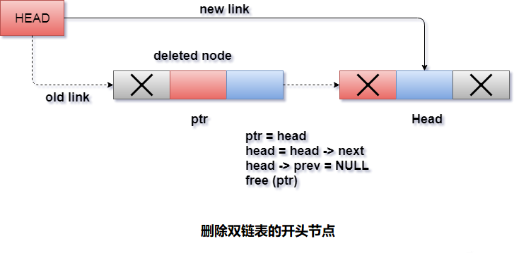

# 双向链表 删除开头节点

删除双向链表中的第一个节点是最简单的操作。只需要将头指针复制到指针`ptr`并将头指针移动到下一个指针。

```c
ptr = head;  
head = head -> next;
```

现在使这个新头节点的`prev`指针指向`NULL`。这将通过使用以下语句来完成。

```c
head -> prev = NULL;
```

现在使用`free`函数释放指针`ptr`。

```c
free(ptr);
```

**算法**

```
第1步：如果HEAD = NULL
    提示 内存溢出。
    转到第6步
第2步：设置PTR = HEAD
第3步：设置HEAD = HEAD->NEXT
第4步：设置HEAD->PREV = NULL
第5步：释放PTR
第6步：退出
```

**示意图**


## C语言实现的示例代码

文件名:linked-list-double-deletion-at-head.c

```c
#include<stdio.h>  
#include<stdlib.h>  
void create(int);
void beginning_delete();
struct node
{
    int data;
    struct node *next;
    struct node *prev;
};
struct node *head;
void main()
{
    int choice, item;
    do
    {
        printf("1.Append List\n");
        printf("2.Delete node from beginning\n");
        printf("3.Exit\n");
        printf("4.Enter your choice ? ");
        scanf("%d", &choice);
        switch (choice)
        {
        case 1:
            printf("Enter the item\n");
            scanf("%d", &item);
            create(item);
            break;
        case 2:
            beginning_delete();
            break;
        case 3:
            exit(0);
            break;
        default:
            printf("Please enter valid choice\n");
        }

    } while (choice != 3);
}
void create(int item)
{

    struct node *ptr = (struct node *)malloc(sizeof(struct node));
    if (ptr == NULL)
    {
        printf("OVERFLOW\n");
    }
    else
    {
        if (head == NULL)
        {
            ptr->next = NULL;
            ptr->prev = NULL;
            ptr->data = item;
            head = ptr;
        }
        else
        {
            ptr->data = item;printf("Press 0 to insert more ?\n");
            ptr->prev = NULL;
            ptr->next = head;
            head->prev = ptr;
            head = ptr;
        }
        printf("Node Inserted\n");
    }

}
void beginning_delete()
{
    struct node *ptr;
    if (head == NULL)
    {
        printf("UNDERFLOW\n");
    }
    else if (head->next == NULL)
    {
        head = NULL;
        free(head);
        printf("Node Deleted\n");
    }
    else
    {
        ptr = head;
        head = head->next;
        head->prev = NULL;
        free(ptr);
        printf("Node Deleted\n");
    }
}
```

```bash
gcc /share/lesson/data-structure/linked-list-double-deletion-at-head.c && ./a.out
```

康康