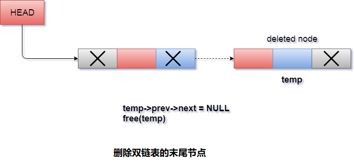

# 双向链表 删除末尾节点

删除双向链表中的最后一个节点需要遍历链表以便到达链表的最后一个节点，然后在该位置进行指针调整。

要删除链表的最后一个节点，需要按照以下步骤操作。

- 如果链表已经为空，则条件`head == NULL`将变为`true`，因此无法继续操作。

- 如果链表中只有一个节点，则条件`head->next == NULL`变为`true`。 在这种情况下，只需要将链表的头部分配为`NULL`并释放头部，以便完全删除列表。

- 否则，只需遍历链表即可到达链表的最后一个节点。这将通过使用以下语句来完成。

  ```c
  ptr = head;   
  if(ptr->next != NULL)  
  {  
    ptr = ptr -> next;   
  }
  ```

- ```
  ptr
  ```

  将指向

  ```
  for
  ```

  循环结束时链表的最后一个节点。 只需将

  ```
  ptr
  ```

  的上一个节点的

  ```
  next
  ```

  指针设为

  ```
  NULL
  ```

  即可。

  ```c
  ptr -> prev -> next = NULL;
  ```

将要删除的节点的指针释放。

```c
free(ptr);
```

**算法步骤**

```
第1步：IF HEAD = NULL
  提示：内存溢出
  转到第7步
[IF结束]

第2步：设置TEMP = HEAD
第3步：重复第4步，TEMP-> NEXT！= NULL
第4步：设置TEMP = TEMP-> NEXT
[循环结束]

第5步：SET TEMP - > PREV-> NEXT = NULL
第6步：释放TEMP
第7步：退出
```

**示意图**



## C语言实现的示例代码

文件名:linked-list-double-deletion-at-tail.c

```c
#include<stdio.h>  
#include<stdlib.h>  
void create(int);
void last_delete();
struct node
{
    int data;
    struct node *next;
    struct node *prev;
};
struct node *head;
void main()
{
    int choice, item;
    do
    {
        printf("1.Append List\n");
        printf("2.Delete node from end\n");
        printf("3.Exit\n");
        printf("4.Enter your choice ? ");
        scanf("%d", &choice);
        switch (choice)
        {
        case 1:
            printf("Enter the item\n");
            scanf("%d", &item);
            create(item);
            break;
        case 2:
            last_delete();
            break;
        case 3:
            exit(0);
            break;
        default:
            printf("Please enter valid choice\n");
        }

    } while (choice != 3);
}
void create(int item)
{
    struct node *ptr = (struct node *)malloc(sizeof(struct node));
    if (ptr == NULL)
    {
        printf("OVERFLOW\n");
    }
    else
    {
        if (head == NULL)
        {
            ptr->next = NULL;
            ptr->prev = NULL;
            ptr->data = item;
            head = ptr;
        }
        else
        {
            ptr->data = item;
            ptr->prev = NULL;
            ptr->next = head;
            head->prev = ptr;
            head = ptr;
        }
        printf("Node Inserted\n");
    }

}
void last_delete()
{
    struct node *ptr;
    if (head == NULL)
    {
        printf("UNDERFLOW\n");
    }
    else if (head->next == NULL)
    {
        head = NULL;
        free(head);
        printf("Node Deleted\n");
    }
    else
    {
        ptr = head;
        if (ptr->next != NULL)
        {
            ptr = ptr->next;
        }
        ptr->prev->next = NULL;
        free(ptr);
        printf("Node Deleted\n");
    }
}
```

```bash
gcc /share/lesson/data-structure/linked-list-double-deletion-at-tail.c && ./a.out
```

康康