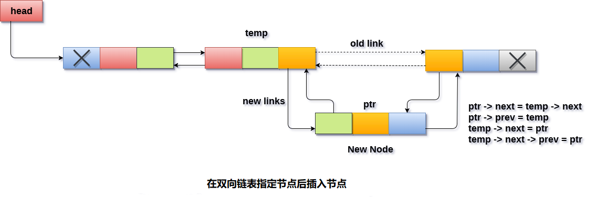

# 双向链表 在指定节点后插入节点

要在列表中的指定节点之后插入节点，需要跳过所需数量的节点以便到达目标节点，然后根据需要调整指针。

为此，请参考使用以下步骤。

- 为新节点分配内存。 请使用以下语句。

  ```c
  ptr = (struct node *)malloc(sizeof(struct node));
  ```

  使用指针

  ```
  temp
  ```

  遍历列表以跳过所需数量的节点以到达指定节点。

  ```c
  temp=head;  
  for(i=0;i<loc;i++)  
  {  
    temp = temp->next;
    // the temp will be null if the list doesn't last long up to mentioned location
    if(temp == NULL)    
    {  
        return;  
    }  
  }
  ```

- ```
  temp
  ```

  将指向

  ```
  for
  ```

  循环结束时的指定节点。要在此节点之后插入新节点，因此需要在此处调整

  ```
  ptr
  ```

  指针。使

  ```
  ptr
  ```

  的下一个指针指向

  ```
  temp
  ```

  的下一个节点。

  ```c
  ptr -> next = temp -> next;
  C
  ```

- 使新节点

  ```
  ptr
  ```

  的

  ```
  prev
  ```

  指针指向

  ```
  temp
  ```

  。

  ```c
  ptr -> prev = temp;
  C
  ```

  使

  ```
  temp
  ```

  指针指向新节点

  ```
  ptr
  ```

  。

  ```c
  temp -> next = ptr;
  C
  ```

  使

  ```
  temp
  ```

  节点的

  ```
  pre
  ```

  指针指向新节点。

  ```c
  temp -> next -> prev = ptr;
  C
  ```

**算法**

```
第1步：IF PTR = NULL
    提示：OVERFLOW
    转到第15步
  [IF结束]

第2步：设置NEW_NODE = PTR
第3步：SET PTR = PTR - > NEXT
第4步：设置NEW_NODE - > DATA = VAL
第5步：SET TEMP = START
第6步：SET I = 0
第7步：重复第8步到第10步直到 I
第8步：SET TEMP = TEMP - > NEXT
第9步：如果TEMP = NULL
第10步：提示 “比所需的元素少”
     转到第15步
    [结束]
  [循环结束]

第11步：设置NEW_NODE - > NEXT = TEMP - > NEXT
第12步：设置NEW_NODE - > PREV = TEMP
第13步：设置TEMP - > NEXT = NEW_NODE
第14步：设置TEMP - > NEXT - > PREV = NEW_NODE
第15步：退出
```

示意图如下 - 



## C语言实现的示例代码

文件名:linked-list-double-insertion-after-specified-node.c

```c
#include<stdio.h>  
#include<stdlib.h>  
void insert_specified(int);
void create(int);
struct node
{
    int data;
    struct node *next;
    struct node *prev;
};
struct node *head;
void main()
{
    int choice, item, loc;
    do
    {
        printf("Enter the item which you want to insert?\n");
        scanf("%d", &item);
        if (head == NULL)
        {
            create(item);
        }
        else
        {
            insert_specified(item);
        }
        printf("Press 0 to insert more ?\n");
        scanf("%d", &choice);
    } while (choice == 0);
}
void create(int item)
{
    struct node *ptr = (struct node *)malloc(sizeof(struct node));
    if (ptr == NULL)
    {
        printf("OVERFLOW");
    }
    else
    {
        if (head == NULL)
        {
            ptr->next = NULL;
            ptr->prev = NULL;
            ptr->data = item;
            head = ptr;
        }
        else
        {
            ptr->data = item;printf("Press 0 to insert more ?\n");
            ptr->prev = NULL;
            ptr->next = head;
            head->prev = ptr;
            head = ptr;
        }
        printf("Node Inserted\n");
    }

}
void insert_specified(int item)
{

    struct node *ptr = (struct node *)malloc(sizeof(struct node));
    struct node *temp;
    int i, loc;
    if (ptr == NULL)
    {
        printf("OVERFLOW\n");
    }
    else
    {
        printf("Enter the location\n");
        scanf("%d", &loc);
        temp = head;
        for (i = 0;i < loc;i++)
        {
            temp = temp->next;
            if (temp == NULL)
            {
                printf("can't insert\n");
                return;
            }
        }
        ptr->data = item;
        ptr->next = temp->next;
        ptr->prev = temp;
        temp->next = ptr;
        temp->next->prev = ptr;
        printf("Node Inserted\n");
    }
}
```

```bash
gcc /share/lesson/data-structure/linked-list-double-insertion-after-specified-node.c && ./a.out
```

康康