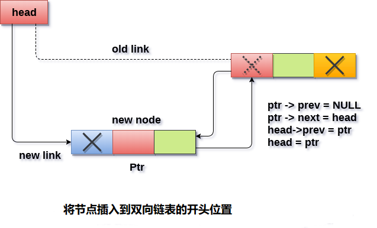

# 双向链表 在开头插入节点

在双向链表中每个节点都包含两个指针，因此与单链表相比，在双链表中保存有更多的指针。

将任何元素插入双向链表有两种情况。 链表为空或包含至少一个元素。 执行以下步骤以在双向链表的开头插入节点。

- 在内存中为新节点分配空间。这将通过使用以下语句来完成。

```c
ptr = (struct node *)malloc(sizeof(struct node));
C
```

- 检查链表是否为空。 如果条件

  ```
  head == NULL
  ```

  成立，则链表为空。 在这种情况下，节点将作为链表的唯一节点插入，因此节点的

  ```
  prev
  ```

  和

  ```
  next
  ```

  指针将指向

  ```
  NULL
  ```

  ，并且头指针将指向此节点。

  ```c
  ptr->next = NULL;  
  ptr->prev=NULL;  
  ptr->data=item;  
  head=ptr;
  C
  ```

- 在第二种情况下，条件

  ```
  head == NULL
  ```

  变为

  ```
  false
  ```

  ，节点将在开头插入。 节点的下一个指针将指向节点的现有头指针。 现有

  ```
  head
  ```

  的

  ```
  prev
  ```

  指针将指向要插入的新节点。这将通过使用以下语句来完成。

  ```c
  ptr->next = head;  
  head->prev=ptr;
  C
  ```

因为，插入的节点是链表的第一个节点，因此它的`prev`指针指向`NULL`。 因此，为其前一部分指定`null`并使头指向此节点。

```c
ptr->prev = NULL;  
head = ptr;
C
```

**算法**

```
第1步：IF ptr = NULL
   提示 “OVERFLOW” 信息
  转到第9步
  [结束]

第2步：设置 NEW_NODE = ptr
第3步：SET ptr = ptr - > NEXT
第4步：设置 NEW_NODE - > DATA = VAL
第5步：设置 NEW_NODE - > PREV = NULL
第6步：设置 NEW_NODE - > NEXT = START
第7步：SET head - > PREV = NEW_NODE
第8步：SET head = NEW_NODE
第9步：退出
```

**示意图**



## C语言实现的示例代码

文件名:linked-list-double-insertion-at-head.c

```c
#include<stdio.h>  
#include<stdlib.h>  
void insertbeginning(int);
struct node
{
    int data;
    struct node *next;
    struct node *prev;
};
struct node *head;
void main()
{
    int choice, item;
    do
    {
        printf("Enter the item which you want to insert?\n");
        scanf("%d", &item);
        insertbeginning(item);
        printf("Press 0 to insert more ?\n");
        scanf("%d", &choice);
    } while (choice == 0);
}
void insertbeginning(int item)
{

    struct node *ptr = (struct node *)malloc(sizeof(struct node));
    if (ptr == NULL)
    {
        printf("OVERFLOW\n");
    }
    else
    {
        if (head == NULL)
        {
            ptr->next = NULL;
            ptr->prev = NULL;
            ptr->data = item;
            head = ptr;
        }
        else
        {
            ptr->data = item;
            ptr->prev = NULL;
            ptr->next = head;
            head->prev = ptr;
            head = ptr;
        }
    }

}
```

```bash
gcc /share/lesson/data-structure/linked-list-double-insertion-at-head.c && ./a.out
```

康康