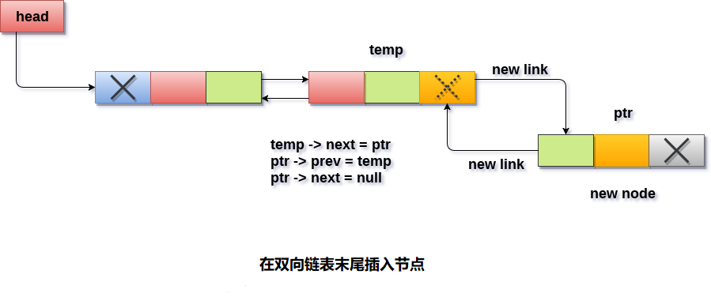

# 双向链表 在末尾插入节点

要在双向链表的插入节点，要分两种情况分别处理：链表是空的还是包含元素。 使用以下步骤以在双向链表的末尾插入节点。

- 为新节点分配内存，使指针

  ```
  ptr
  ```

  指向要插入的新节点。

  ```c
  ptr = (struct node *) malloc(sizeof(struct node));
  C
  ```

- 检查链表是否为空。如果条件`head == NULL`成立，则链表为空。 在这种情况下，节点将作为链表的唯一节点插入，因此节点的`prev`和`next`指针将指向`NULL`，并且`head`指针将指向此节点。

  ```c
  ptr->next = NULL;  
  ptr->prev=NULL;  
  ptr->data=item;  
  head=ptr;
  C
  ```

- 在第二种情况下，条件`head == NULL`变为`false`。新节点将作为链表的最后一个节点插入。 为此，需要遍历整个链表才能到达链表的最后一个节点。 将指针`temp`初始化为`head`并使用此指针遍历链表。

  ```c
  temp = head;   
  while (temp != NULL)  
  {  
    temp = temp -> next;   
  }
  C
  ```

  指针`temp`指向此`while`循环结束时的最后一个节点。 现在，只需要做一些指针调整就可以将新节点`ptr`插入到链表中。 首先，使`temp`指针指向要插入的新节点，即`ptr`。

```c
temp->next =ptr;
C
```

使节点`ptr`的前一指针指向链表的现有最后一个节点，即`temp`。

```c
ptr -> prev = temp;
C
```

使节点`ptr`的`next`指针指向`null`，因为它将是链表新的最后一个节点。

```c
ptr -> next = NULL
C
```

**算法**

```
第1步：IF PTR = NULL
  提示 OVERFLOW 
   转到第11步
  [IF结束]

第2步：设置NEW_NODE = PTR
第3步：SET PTR = PTR - > NEXT
第4步：设置NEW_NODE - > DATA = VAL
第5步：设置NEW_NODE - > NEXT = NULL
第6步：SET TEMP = START
第7步：在TEMP - > NEXT！= NULL 时重复第8步
第8步：SET TEMP = TEMP - > NEXT
[循环结束]

第9步：设置TEMP - > NEXT = NEW_NODE
第10步：SET NEW_NODE - > PREV = TEMP
第11步：退出
```

示意图 - 



## C语言实现的示例代码

文件名:linked-list-double-insertion-at-tail.c

```c
#include<stdio.h>  
#include<stdlib.h>  
void insertlast(int);
struct node
{
    int data;
    struct node *next;
    struct node *prev;
};
struct node *head;
void main()
{
    int choice, item;
    do
    {
        printf("Enter the item which you want to insert?\n");
        scanf("%d", &item);
        insertlast(item);
        printf("Press 0 to insert more ?\n");
        scanf("%d", &choice);
    } while (choice == 0);
}
void insertlast(int item)
{

    struct node *ptr = (struct node *) malloc(sizeof(struct node));
    struct node *temp;
    if (ptr == NULL)
    {
        printf("OVERFLOW");

    }
    else
    {

        ptr->data = item;
        if (head == NULL)
        {
            ptr->next = NULL;
            ptr->prev = NULL;
            head = ptr;
        }
        else
        {
            temp = head;
            while (temp->next != NULL)
            {
                temp = temp->next;
            }
            temp->next = ptr;
            ptr->prev = temp;
            ptr->next = NULL;
        }
        printf("Node Inserted\n");

    }
}
```

```bash
gcc /share/lesson/data-structure/linked-list-double-insertion-at-tail.c && ./a.out
```

康康