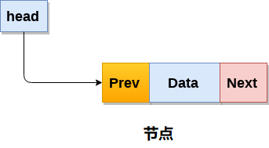
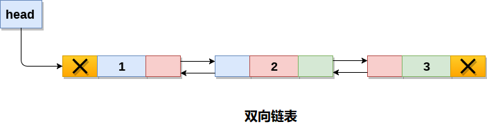
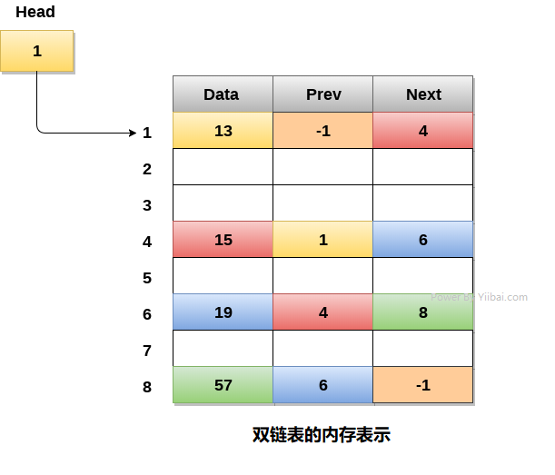

# 双向链表

双向链表是一种复杂类型的链表，它的节点包含指向序列中前一个节点和下一个节点的指针。 因此，在双向链表中，节点由三部分组成：节点数据，指向下一个节点的指针(`next`指针)，指向前一个节点的指针(`prev`指针)。 双向链表中的示例节点如图所示。



包含三个节点的双向链表在其数据部分中具有从`1`到`3`的数值，如下图所示。



在C语言中，双向链表中节点的结构体如下所示：

```c
struct node   
{  
    struct node *prev;   
    int data;  
    struct node *next;   
}
```

第一个节点的`prev`部分和最后一个节点的`next`部分将始终包含指向`NULL`值。

在单链表中，只能在一个方向上遍历，因为每个节点包含下一个节点的地址，并且它没有其先前节点的任何记录。 然而，双重链表克服了单链表的这种限制。 由于列表的每个节点都包含其先前节点的地址，因此可以通过使用存储在每个节点的前一部分内的先前地址来找到关于前一节点的所有细节。

## 双重链表内存表示

双向链表的内存表示如下图所示。 通常，双向链表为每个节点消耗更多空间，因此它有更广泛的基本操作，例如：插入和删除。 但是，可以轻松地操作链表中的元素，因为链表在两个方向(向前和向后)都保存指针。

在下面的图像中，链表的第一个元素即`13`存储在地址`1`中。头指针指向起始地址`1`。由于这是第一个添加到链表的元素，因此链表的`prev`包含`null`。 链表的下一个节点位于地址`4`，因此第一个节点在其下一个指针(`Next`)中包含`4`。

可以用这种方式遍历链表，直到在下一部分找到包含`null`或`-1`的节点。



## 双向链表上的操作

**节点创建**

```c
struct node   
{  
    struct node *prev;  
    int data;  
    struct node *next;  
};  
struct node *head;
```

有关双向链表的所有操作如下表所述。

| 编号 | 操作                                                         | 描述                                                         |
| ---- | ------------------------------------------------------------ | ------------------------------------------------------------ |
| 1    | [在开头插入节点](./linked-list-double-insertion-at-head.html) | 在链表的开头添加节点。                                       |
| 2    | [在末尾插入节点](./linked-list-double-insertion-at-tail.html) | 在链表的末尾添加节点。                                       |
| 3    | [在指定位置插入节点](./linked-list-double-insertion-after-specified-node.html) | 在链表的指定位置之后插入节点。                               |
| 4    | [在开头删除节点](./linked-list-double-deletion-at-head.html) | 从链表的开头删除节点。                                       |
| 5    | [在末尾删除节点](./linked-list-double-deletion-at-tail.html) | 从链表末尾删除节点。                                         |
| 6    | [删除给定数据的节点](./linked-list-double-deletion-after-specified-node.html) | 删除包含给定数据的节点。                                     |
| 7    | [搜索](./linked-list-double-searching.html) | 将每个节点数据与要搜索的数据项进行比较，如果找到数据项则返回`null`，则返回链表中数据项的位置。 |
| 8    | [遍历](./linked-list-double-traversing.html) | 访问链表的每个节点至少一次，以执行某些特定操作，如：搜索，排序，显示等。 |

## C语言实现的示例代码

文件名:linked-list-double.c

```c
#include<stdio.h>  
#include<stdlib.h>  
struct node
{
    struct node *prev;
    struct node *next;
    int data;
};
struct node *head;
void insertion_beginning();
void insertion_last();
void insertion_specified();
void deletion_beginning();
void deletion_last();
void deletion_specified();
void display();
void search();
void main()
{
    int choice = 0;
    while (choice != 9)
    {
        printf("*********Main Menu*********\n");
        printf("Choose one option from the following list ...\n");
        printf("===============================================\n");
        printf("1.Insert in begining\n2.Insert at last\n3.Insert at any random location\n4.Delete from Beginning\n5.Delete from last\n6.Delete the node after the given data\n7.Search\n8.Show\n9.Exit\n");  
            printf("Enter your choice?\n");
        scanf("%d", &choice);
        switch (choice)
        {
        case 1:
            insertion_beginning();
            break;
        case 2:
            insertion_last();
            break;
        case 3:
            insertion_specified();
            break;
        case 4:
            deletion_beginning();
            break;
        case 5:
            deletion_last();
            break;
        case 6:
            deletion_specified();
            break;
        case 7:
            search();
            break;
        case 8:
            display();
            break;
        case 9:
            exit(0);
            break;
        default:
            printf("Please enter valid choice..");
        }
    }
}
void insertion_beginning()
{
    struct node *ptr;
    int item;
    ptr = (struct node *)malloc(sizeof(struct node));
    if (ptr == NULL)
    {
        printf("OVERFLOW\n");
    }
    else
    {
        printf("Enter Item value");
        scanf("%d", &item);

        if (head == NULL)
        {
            ptr->next = NULL;
            ptr->prev = NULL;
            ptr->data = item;
            head = ptr;
        }
        else
        {
            ptr->data = item;
            ptr->prev = NULL;
            ptr->next = head;
            head->prev = ptr;
            head = ptr;
        }
        printf("Node inserted\n");
    }

}
void insertion_last()
{
    struct node *ptr, *temp;
    int item;
    ptr = (struct node *) malloc(sizeof(struct node));
    if (ptr == NULL)
    {
        printf("OVERFLOW\n");
    }
    else
    {
        printf("Enter value");
        scanf("%d", &item);
        ptr->data = item;
        if (head == NULL)
        {
            ptr->next = NULL;
            ptr->prev = NULL;
            head = ptr;
        }
        else
        {
            temp = head;
            while (temp->next != NULL)
            {
                temp = temp->next;
            }
            temp->next = ptr;
            ptr->prev = temp;
            ptr->next = NULL;
        }

    }
    printf("node inserted\n");
}
void insertion_specified()
{
    struct node *ptr, *temp;
    int item, loc, i;
    ptr = (struct node *)malloc(sizeof(struct node));
    if (ptr == NULL)
    {
        printf("OVERFLOW\n");
    }
    else
    {
        temp = head;
        printf("Enter the location ");
        scanf("%d", &loc);
        for (i = 0;i < loc;i++)
        {
            temp = temp->next;
            if (temp == NULL)
            {
                printf("There are less than %d elements", loc);
                return;
            }
        }
        printf("Enter value");
        scanf("%d", &item);
        ptr->data = item;
        ptr->next = temp->next;
        ptr->prev = temp;
        temp->next = ptr;
        temp->next->prev = ptr;
        printf("node inserted\n");
    }
}
void deletion_beginning()
{
    struct node *ptr;
    if (head == NULL)
    {
        printf("UNDERFLOW\n");
    }
    else if (head->next == NULL)
    {
        head = NULL;
        free(head);
        printf("node deleted\n");
    }
    else
    {
        ptr = head;
        head = head->next;
        head->prev = NULL;
        free(ptr);
        printf("node deleted\n");
    }

}
void deletion_last()
{
    struct node *ptr;
    if (head == NULL)
    {
        printf("UNDERFLOW\n");
    }
    else if (head->next == NULL)
    {
        head = NULL;
        free(head);
        printf("node deleted\n");
    }
    else
    {
        ptr = head;
        if (ptr->next != NULL)
        {
            ptr = ptr->next;
        }
        ptr->prev->next = NULL;
        free(ptr);
        printf("node deleted\n");
    }
}
void deletion_specified()
{
    struct node *ptr, *temp;
    int val;
    printf("Enter the data after which the node is to be deleted : ");
    scanf("%d", &val);
    ptr = head;
    while (ptr->data != val)
        ptr = ptr->next;
    if (ptr->next == NULL)
    {
        printf("Can't delete\n");
    }
    else if (ptr->next->next == NULL)
    {
        ptr->next = NULL;
    }
    else
    {
        temp = ptr->next;
        ptr->next = temp->next;
        temp->next->prev = ptr;
        free(temp);
        printf("node deleted\n");
    }
}
void display()
{
    struct node *ptr;
    printf("printing values...\n");
    ptr = head;
    while (ptr != NULL)
    {
        printf("%d\n", ptr->data);
        ptr = ptr->next;
    }
}
void search()
{
    struct node *ptr;
    int item, i = 0, flag;
    ptr = head;
    if (ptr == NULL)
    {
        printf("Empty List\n");
    }
    else
    {
        printf("Enter item which you want to search?\n");
        scanf("%d", &item);
        while (ptr != NULL)
        {
            if (ptr->data == item)
            {
                printf("item found at location %d ", i + 1);
                flag = 0;
                break;
            }
            else
            {
                flag = 1;
            }
            i++;
            ptr = ptr->next;
        }
        if (flag == 1)
        {
            printf("Item not found\n");
        }
    }

}
```

```bash
gcc /share/lesson/data-structure/linked-list-double.c && ./a.out
```

康康