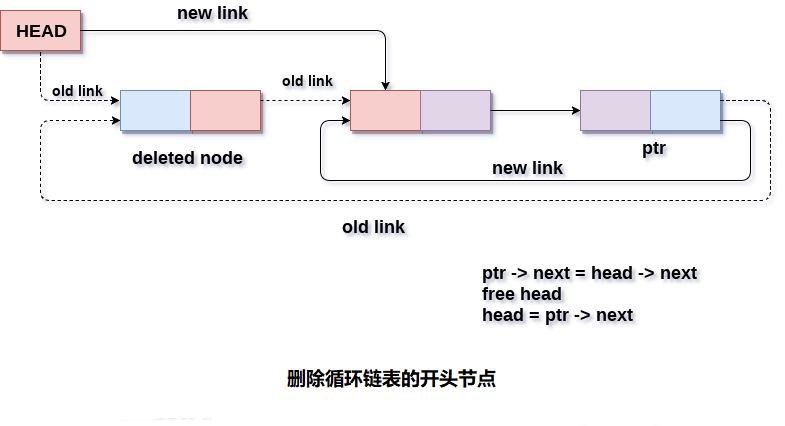

# 循环单链向表 删除开头元素

要删除循环单链表中的开头节点，需要进行一些指针调整。

在开头有三种从循环单链表中删除节点的方案有以下几种。

#### 情况1 :(链表为空)

如果链表为空，则条件`head == NULL`将变为`true`，在这种情况下，只需要在屏幕上打印下溢并退出。

```c
if(head == NULL)
{  
    printf("UNDERFLOW\n");
    return;
}
```

#### 情况2 :(链表包含单个节点)

如果链表只包含一个节点，则条件`head->next == head`将变为`true`。 在这种情况下，需要删除整个链表并使头指针空闲。 这将通过使用以下语句来完成。

```c
if(head->next == head)  
{  
    head = NULL;  
    free(head);  
}
```

#### 情况3 :(链表包含多个节点)

如果链表包含多个节点，那么在这种情况下，需要使用指针`ptr`遍历链表以到达列表的最后一个节点。 这将通过使用以下语句来完成。

```c
ptr = head;   
while(ptr -> next != head){
    ptr = ptr -> next;
}
```

在循环结束时，指针`ptr`指向链表的最后一个节点。 因为，链表的最后一个节点指向链表的头节点。 因此，这将改变为现在，链表的最后一个节点将指向头节点的下一个节点。

```c
ptr->next = head->next;
```

现在，通过使用C语言中的`free()`函数释放头指针。

```c
free(head);
```

使节点指向最后一个节点的下一个节点，即链表的新头。

```c
head = ptr->next;
```

这样，节点将从一开始就从循环单链表中删除。

**算法**

```
第1步：IF HEAD = NULL
  提示内存溢出
   转到第8步
  [IF结束]

第2步：设置PTR = HEAD
第3步：在PTR->NEXT！= HEAD 时重复第4步
第4步：SET PTR = PTR->next
[循环结束]

第5步：设置PTR->NEXT = HEAD->NEXT
第6步：免费头
第7步：SET HEAD = PTR->NEXT
第8步：退出
```

**示意图** 



## C语言实现的示例代码

文件名:linked-list-single-circular-deletion-at-head.c

```c
#include<stdio.h>  
#include<stdlib.h>  
void create(int);
void beg_delete();
struct node
{
    int data;
    struct node *next;
};
struct node *head;
void main()
{
    int choice, item;
    do
    {
        printf("1.Append List\n2.Delete Node from beginning\n3.Exit\n4.Enter your choice?");
        scanf("%d", &choice);
        switch (choice)
        {
        case 1:
            printf("Enter the item\n");
            scanf("%d", &item);
            create(item);
            break;
        case 2:
            beg_delete();
            break;
        case 3:
            exit(0);
            break;
        default:
            printf("Please Enter valid choice\n");
        }
    } while (choice != 3);
}
void create(int item)
{

    struct node *ptr = (struct node *)malloc(sizeof(struct node));
    struct node *temp;
    if (ptr == NULL)
    {
        printf("OVERFLOW");
    }
    else
    {
        ptr->data = item;
        if (head == NULL)
        {
            head = ptr;
            ptr->next = head;
        }else
        {
            temp = head;
            while (temp->next != head)
                temp = temp->next;
            ptr->next = head;
            temp->next = ptr;
            head = ptr;
        }
        printf("Node Inserted\n");
    }

}
void beg_delete()
{
    struct node *ptr;
    if (head == NULL)
    {
        printf("UNDERFLOW\n");
    }else if (head->next == head)
    {
        head = NULL;
        free(head);
        printf("Node Deleted\n");
    }else
    {
        ptr = head;
        while (ptr->next != head)
            ptr = ptr->next;
        ptr->next = head->next;
        free(head);
        head = ptr->next;
        printf("Node Deleted\n");
    }
}
```

```bash
gcc /share/lesson/data-structure/linked-list-single-circular-deletion-at-head.c && ./a.out
```

康康