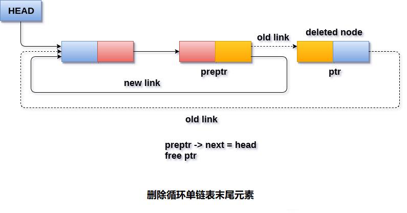

# 循环单向链表 删除末尾元素

在循环单链表中删除末尾节点有三种情况。

#### 情况1(链表为空)

如果链表为空，则条件`head == NULL`将变为`true`，在这种情况下，只需要在屏幕上打印下溢并退出。

```c
if(head == NULL)  
{  
    printf("UNDERFLOW\n");    
    return;   
}
```

#### 情况2(链表包含单个节点)

如果链表包含单个节点，则条件`head->next == head`将变为`true`。 在这种情况下，需要删除整个链表并使头指针空闲。 这将通过使用以下语句来完成。

```c
if(head->next == head)  
{  
    head = NULL;  
    free(head);  
}
```

#### 情况3(链表包含多个元素)

如果链表中有多个节点，那么要删除最后一个节点，需要到达最后一个节点。 还需要跟踪链表的倒数第二个节点。 为此，需要定义两个指针`ptr`和`preptr`。 以下代码序列用于此目的。

```c
ptr = head;  
while(ptr ->next != head)  
{  
    preptr=ptr;  
    ptr = ptr->next;  
}
```

现在，需要再做一次指针调整。需要将指针指向`pretr`的`next`指向`ptr`的`next`(即`head`)，然后使指针`ptr`空闲(释放)。

```c
preptr->next = ptr -> next;  
free(ptr);
```

**算法**

```
第1步：IF HEAD = NULL
   提示 “内存溢出”
    转到第8步
   [IF结束]

第2步：设置PTR = HEAD
第3步：重复第4步和第5步，同时PTR - > NEXT！= HEAD
第4步：SET PREPTR = PTR
第5步：SET PTR = PTR - > NEXT
[循环结束]

第6步：设置PREPTR - > NEXT = HEAD
第7步：释放PTR
第8步：退出
```

**示意图**



## C语言实现的示例代码

文件名:linked-list-single-circular-deletion-at-tail.c

```c
#include<stdio.h>  
#include<stdlib.h>  
void create(int);
void last_delete();
struct node
{
    int data;
    struct node *next;
};
struct node *head;
void main()
{
    int choice, item;
    do
    {
        printf("1.Append List\n2.Delete Node from end\n3.Exit\n4.Enter your choice?");
        scanf("%d", &choice);
        switch (choice)
        {
        case 1:
            printf("Enter the item\n");
            scanf("%d", &item);
            create(item);
            break;
        case 2:
            last_delete();
            break;
        case 3:
            exit(0);
            break;
        default:
            printf("Please Enter valid choice\n");
        }

    } while (choice != 3);
}
void create(int item)
{

    struct node *ptr = (struct node *)malloc(sizeof(struct node));
    struct node *temp;
    if (ptr == NULL)
    {
        printf("OVERFLOW\n");
    }
    else
    {
        ptr->data = item;
        if (head == NULL)
        {
            head = ptr;
            ptr->next = head;
        }
        else
        {
            temp = head;
            while (temp->next != head)
                temp = temp->next;
            ptr->next = head;
            temp->next = ptr;
            head = ptr;
        }
        printf("Node Inserted\n");
    }

}
void last_delete()
{
    struct node *ptr, *preptr;
    if (head == NULL)
    {
        printf("UNDERFLOW\n");
    }
    else if (head->next == head)
    {
        head = NULL;
        free(head);
        printf("Node Deleted\n");
    }
    else
    {
        ptr = head;
        while (ptr->next != head)
        {
            preptr = ptr;
            ptr = ptr->next;
        }
        preptr->next = ptr->next;
        free(ptr);
        printf("Node Deleted\n");
    }
}
```

```bash
gcc /share/lesson/data-structure/linked-list-single-circular-deletion-at-tail.c && ./a.out
```

康康