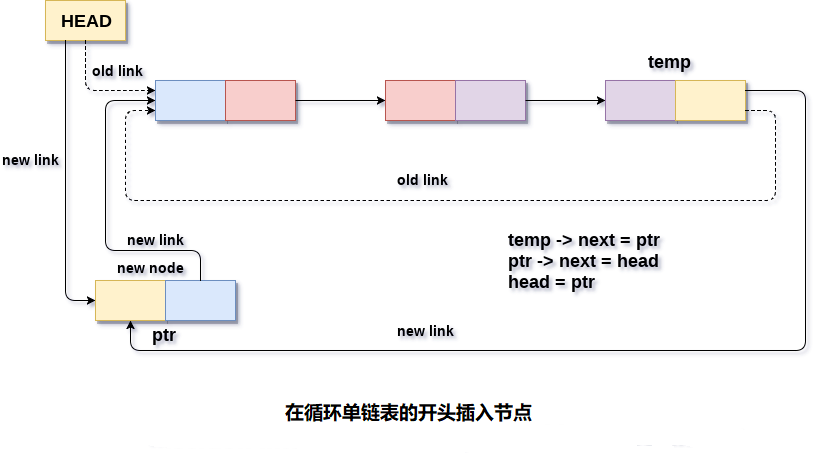

# 循环单向链表 在开头插入节点

在开头将节点插入循环单链表中有两种情况。 第一种情况是：节点将插入空链表中，第二种情况 是将节点将插入非空的链表中。

首先，使用C语言的`malloc`方法为新节点分配内存空间。

```c
struct node *ptr = (struct node *)malloc(sizeof(struct node));
```

在第一种情况下，条件`head == NULL`将为`true`。 因为，插入节点的链表是一个循环单链表，因此链表中唯一的节点(只是插入到列表中)将仅指向自身。还需要使头指针指向此节点。 这将通过使用以下语句来完成。

```c
if(head == NULL)  
{  
    head = ptr;  
    ptr -> next = head;  
}
```

在第二种情况下，条件`head == NULL`将变为`false`，这意味着链表至少包含一个节点。 在这种情况下，需要遍历链表才能到达链表的最后一个节点。 这将通过使用以下语句来完成。

```c
temp = head;  
while(temp->next != head){
    temp = temp->next;  
}
```

在循环结束时，指针`temp`将指向链表的最后一个节点。 因为，在循环单链表中，链表的最后一个节点包含指向链表的第一个节点的指针。 因此，需要使最后一个节点的`next`指针指向链表的头节点，并且插入链表的新节点将成为链表的新头节点，因此`temp`的`next`指针将指向新节点`ptr`。

这将通过使用以下语句来完成。

```c
temp -> next = ptr;
```

节点`temp`的`next`指针将指向链表的现有头节点。

```c
ptr->next = head;
```

现在，使新节点`ptr`成为循环单链表的新头节点。

```c
head = ptr;
```

以这种方式，节点`ptr`可以插入循环单链表中。

**算法**

```
第1步：IF PTR = NULL
   提示 OVERFLOW
  转到第11步
  [IF结束]

第2步：设置NEW_NODE = PTR
第3步：SET PTR = PTR - > NEXT
第4步：设置NEW_NODE - > DATA = VAL
第5步：设置TEMP = HEAD
第6步：在TEMP - > NEXT！= HEAD 时重复第8步
第7步：SET TEMP = TEMP - > NEXT
[循环结束]

第8步：设置NEW_NODE - > NEXT = HEAD
第9步：SET TEMP→NEXT = NEW_NODE
第10步：SET HEAD = NEW_NODE
第11步：退出
```

**示意图**



## C语言实现的示例代码

文件名:linked-list-single-circular-insertion-at-head.c

```c
#include<stdio.h>  
#include<stdlib.h>  
void beg_insert(int);
struct node
{
    int data;
    struct node *next;
};
struct node *head;
void main()
{
    int choice, item;
    do
    {
        printf("Enter the item which you want to insert?\n");
        scanf("%d", &item);
        beg_insert(item);
        printf("Press 0 to insert more ?\n");
        scanf("%d", &choice);
    } while (choice == 0);
}
void beg_insert(int item)
{

    struct node *ptr = (struct node *)malloc(sizeof(struct node));
    struct node *temp;
    if (ptr == NULL)
    {
        printf("OVERFLOW\n");
    }
    else
    {
        ptr->data = item;
        if (head == NULL)
        {
            head = ptr;
            ptr->next = head;
        }
        else
        {
            temp = head;
            while (temp->next != head)
                temp = temp->next;
            ptr->next = head;
            temp->next = ptr;
            head = ptr;
        }
        printf("Node Inserted\n");
    }

}
```

```bash
gcc /share/lesson/data-structure/linked-list-single-circular-insertion-at-head.c && ./a.out
```

康康