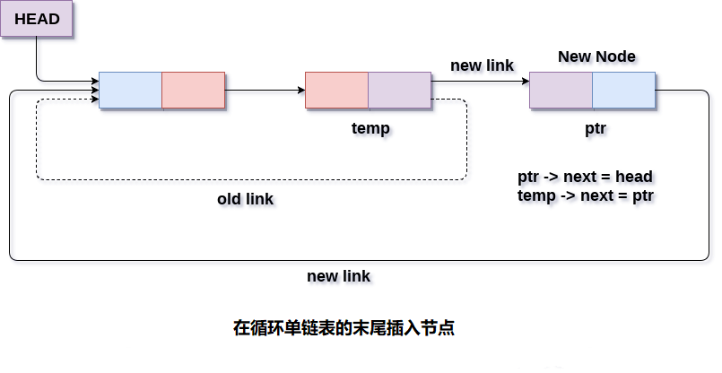

# 循环单向链表 在末尾插入节点

在循环单链表的末尾插入节点有两种情况。 第一种情况：将节点插入空链表中，第一种情况：将节点插入非空链表中。
首先，使用C语言的`malloc`函数为新节点分配内存空间。

```c
struct node *ptr = (struct node *)malloc(sizeof(struct node));
```

在第一情况中，条件`head == NULL`将为`true`。 因为，插入节点是一个循环单链表的唯一节点(只是插入到链表中)将仅指向自身。 还需要使`head`指针指向此节点。 这将通过使用以下语句来完成。

```c
if(head == NULL)  
{  
    head = ptr;  
    ptr -> next = head;  
}
```

在第二种情况下，条件`head == NULL`将变为`false`，该链表至少包含一个节点。 在这种情况下，需要遍历链表才能到达链表的最后一个节点。 这将通过使用以下语句来完成。

```c
temp = head;  
while(temp->next != head){
    temp = temp->next; 
}
```

在循环结束时，指针`temp`将指向链表的最后一个节点。 因为，插入链表的新节点将是链表的新的最后一个节点。 因此，现有的最后一个节点即`temp`必须指向新节点`ptr`。 这是通过使用以下语句完成的。

```c
temp -> next = ptr;
```

链表的新的最后一个节点，即`ptr`将指向链表的头节点。

```c
ptr -> next = head;
```

这样，新节点将在开头插入到循环单链表中。

**算法**

```
第1步：IF PTR = NULL
   提示 OVERFLOW
    转到第1步
   [IF结束]

第2步：设置NEW_NODE = PTR
第3步：SET PTR = PTR - > NEXT
第4步：设置NEW_NODE - > DATA = VAL
第5步：设置NEW_NODE - > NEXT = HEAD
第6步：设置TEMP = HEAD
第7步：在TEMP - > NEXT！= HEAD 时重复第8步
第8步：SET TEMP = TEMP - > NEXT
[循环结束]

第9步：设置TEMP - > NEXT = NEW_NODE
第10步：退出
```

**示意图**



## C语言实现的示例代码

文件名:linked-list-single-circular-insertion-at-tail.c

```c
void lastinsert(struct node*ptr, struct node *temp, int item)
{
    ptr = (struct node *)malloc(sizeof(struct node));
    if (ptr == NULL)
    {
        printf("OVERFLOW\n");
    }
    else
    {
        ptr->data = item;
        if (head == NULL)
        {
            head = ptr;
            ptr->next = head;
        }
        else
        {
            temp = head;
            while (temp->next != head)
            {
                temp = temp->next;
            }
            temp->next = ptr;
            ptr->next = head;
        }
    }

}
```

```bash
gcc /share/lesson/data-structure/linked-list-single-circular-insertion-at-tail.c && ./a.out
```

康康