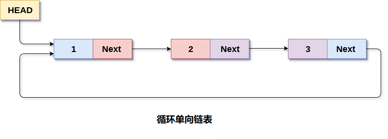
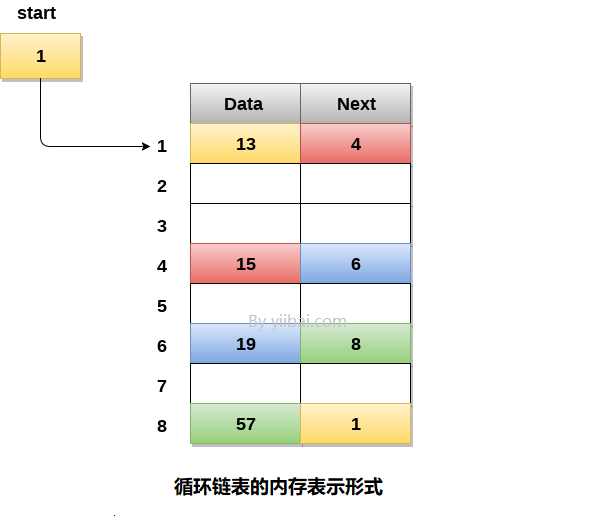

# 循环单向链表

在循环单链表中，链表的最后一个节点包含指向链表的第一个节点的指针。可以有循环单向链表以及循环双链表。

遍历一个循环单链表，直到到达开始的同一个节点。循环单链表类似于链表，但它没有开始也没有结束。任何节点的下一部分都不存在`NULL`值。

下图显示了一个循环单链表。


循环链表主要用于操作系统中的任务维护。有许多例子，循环链表用于计算机科学，包括浏览器，记录用户过去访问过的页面记录也可以以循环链表的形式保存，并且可以在点击前一个按钮时再次访问。

## 1. 循环链表的内存表示

在下图中，包含`4`个科目中学生分数的循环链表的内存表示形式。但是，该图显示了循环列表如何存储在内存中。链表的开头或`head`指向索引为`1`的元素，`data`部分包含分数值为`13`，`next`部分包含地址为`4`。它与存储在链表的第`4`个索引处的节点链接。

但是，由于内存中是循环链表，因此链表的最后一个节点包含链表的第一个节点的地址。



还可以在内存中有多个链表，并且不同的起始指针指向链表中的不同起始节点。 最后一个节点由其`next`部分标识，该部分包含链表的起始节点的地址。必须能够识别任何链表的最后一个节点，以便可以找到遍历链表时需要执行的迭代次数。

## 循环单向链表上的操作

#### 插入

| 编号 | 操作                                                         | 描述                           |
| ---- | ------------------------------------------------------------ | ------------------------------ |
| 1    | [插入开头](./linked-list-single-circular-insertion-at-head.html) | 将节点添加到循环单链表的开头。 |
| 2    | [插入未尾](./linked-list-single-circular-insertion-at-end.html) | 将节点添加到循环单链表的未尾。 |

#### 删除和遍历

| 编号 | 操作                                                         | 描述                                                         |
| ---- | ------------------------------------------------------------ | ------------------------------------------------------------ |
| 1    | [删除开头节点](./linked-list-single-circular-deletion-at-head.html) | 删除循环单链表中的开头节点。                                 |
| 2    | [删除未尾节点](./linked-list-single-circular-deletion-at-tail.html) | 删除循环单链表中的末尾的节点。                               |
| 3    | [搜索](linked-list-single-circular-searching.html)           | 将循环单链表中节点的数据项与给定数据进行比较，如果找到则返回链表中数据项所在的位置，否则返回`null`。 |
| 4    | [遍历](./linked-list-single-circular-traversing.html)        | 访问链表的每个元素至少一次，以执行某些特定操作。             |


## C语言实现的示例代码

文件名:linked-list-single-circular.c

```c
#include<stdio.h>  
#include<stdlib.h>  
struct node
{
    int data;
    struct node *next;
};
struct node *head;

void beginsert();
void lastinsert();
void randominsert();
void begin_delete();
void last_delete();
void random_delete();
void display();
void search();
void main()
{
    int choice = 0;
    while (choice != 7)
    {
        printf("*********Main Menu*********\n");
        printf("Choose one option from the following list ...\n");
        printf("===============================================\n");
        printf("1.Insert in begining\n2.Insert at last\n");
        printf("3.Delete from Beginning\n4.Delete from last\n");
        printf("5.Search for an element\n6.Show\n7.Exit\n");
        printf("Enter your choice?\n");
        scanf("%d", &choice);
        switch (choice)
        {
        case 1:
            beginsert();
            break;
        case 2:
            lastinsert();
            break;
        case 3:
            begin_delete();
            break;
        case 4:
            last_delete();
            break;
        case 5:
            search();
            break;
        case 6:
            display();
            break;
        case 7:
            exit(0);
            break;
        default:
            printf("Please enter valid choice..");
        }
    }
}
void beginsert()
{
    struct node *ptr, *temp;
    int item;
    ptr = (struct node *)malloc(sizeof(struct node));
    if (ptr == NULL)
    {
        printf("OVERFLOW");
    }
    else
    {
        printf("Enter the node data?");
        scanf("%d", &item);
        ptr->data = item;
        if (head == NULL)
        {
            head = ptr;
            ptr->next = head;
        }
        else
        {
            temp = head;
            while (temp->next != head)
                temp = temp->next;
            ptr->next = head;
            temp->next = ptr;
            head = ptr;
        }
        printf("node inserted\n");
    }

}
void lastinsert()
{
    struct node *ptr, *temp;
    int item;
    ptr = (struct node *)malloc(sizeof(struct node));
    if (ptr == NULL)
    {
        printf("OVERFLOW\n");
    }
    else
    {
        printf("Enter Data?");
        scanf("%d", &item);
        ptr->data = item;
        if (head == NULL)
        {
            head = ptr;
            ptr->next = head;
        }
        else
        {
            temp = head;
            while (temp->next != head)
            {
                temp = temp->next;
            }
            temp->next = ptr;
            ptr->next = head;
        }

        printf("node inserted\n");
    }

}

void begin_delete()
{
    struct node *ptr;
    if (head == NULL)
    {
        printf("UNDERFLOW");
    }
    else if (head->next == head)
    {
        head = NULL;
        free(head);
        printf("node deleted\n");
    }

    else
    {
        ptr = head;
        while (ptr->next != head)
            ptr = ptr->next;
        ptr->next = head->next;
        free(head);
        head = ptr->next;
        printf("node deleted\n");

    }
}
void last_delete()
{
    struct node *ptr, *preptr;
    if (head == NULL)
    {
        printf("UNDERFLOW");
    }
    else if (head->next == head)
    {
        head = NULL;
        free(head);
        printf("node deleted\n");

    }
    else
    {
        ptr = head;
        while (ptr->next != head)
        {
            preptr = ptr;
            ptr = ptr->next;
        }
        preptr->next = ptr->next;
        free(ptr);
        printf("node deleted\n");

    }
}

void search()
{
    struct node *ptr;
    int item, i = 0, flag = 1;
    ptr = head;
    if (ptr == NULL)
    {
        printf("Empty List\n");
    }
    else
    {
        printf("Enter item which you want to search?\n");
        scanf("%d", &item);
        if (head->data == item)
        {
            printf("item found at location %d", i + 1);
            flag = 0;
        }
        else
        {
            while (ptr->next != head)
            {
                if (ptr->data == item)
                {
                    printf("item found at location %d ", i + 1);
                    flag = 0;
                    break;
                }
                else
                {
                    flag = 1;
                }
                i++;
                ptr = ptr->next;
            }
        }
        if (flag != 0)
        {
            printf("Item not found\n");
        }
    }

}

void display()
{
    struct node *ptr;
    ptr = head;
    if (head == NULL)
    {
        printf("nothing to print");
    }
    else
    {
        printf("printing values ... \n");

        while (ptr->next != head)
        {

            printf("%d\n", ptr->data);
            ptr = ptr->next;
        }
        printf("%d\n", ptr->data);
    }

}
```

```bash
gcc /share/lesson/data-structure/linked-list-single-circular.c && ./a.out
```

康康