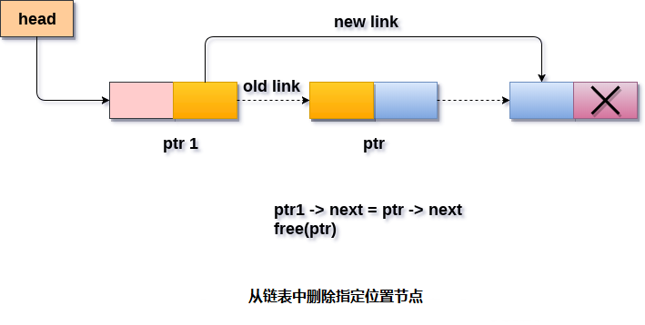

# 单链表 删除指定节点之后的节点

要删除在指定节点之后存在的节点，需要跳过所需数量的节点以到达节点，之后的节点将被删除。 需要跟踪这两个节点。如果在该节点之前存在的节点，则将删除该节点。 为此，使用了两个指针：`ptr`和`ptr1`。

使用以下语句来执行此操作。

```c
ptr = head;
for (i = 0;i < loc;i++)
{
    ptr1 = ptr;
    ptr = ptr->next;

    if (ptr == NULL)
    {
        printf("There are less than %d elements in the list..", loc);
        return;
    }
}
```

现在，任务差不多完成了，只需要做一些指针调整。 使`ptr1`(指向指定节点)的下一个指向`ptr`的下一个(要删除的节点)。

这将通过使用以下语句来完成。

```c
ptr1 ->next = ptr ->next;  
free(ptr);
```

**算法**

```
第1步：如果HEAD = NULL
打印提示内存溢出
    转到第10步
   结束时间

第2步：设置TEMP = HEAD
第3步：设置I = 0
第4步：重复第5步到第8步直到 I 
第5步：TEMP1 = TEMP
第6步：TEMP = TEMP→NEXT
第7步：如果TEMP = NULL
提示“不存在节点”
    转到第12步
    结束条件

第8步：I = I + 1
循环结束

第9步：TEMP1→NEXT = TEMP→NEXT
第10步：释放 TEMP 
第11步：退出
```

**示意图** - 



## C语言实现的示例代码

文件名:linked-list-single-deletion-after-specified-node.c

```c
#include<stdio.h>  
#include<stdlib.h>  
void create(int);
void delete_specified();
struct node
{
    int data;
    struct node *next;
};
struct node *head;
void main()
{
    int choice, item;
    do
    {
        printf("1.Append List\n");
        printf("2.Delete node\n"): 
        printf("3.Exit\n"): 
        printf("4.Enter your choice?");
        scanf("%d", &choice);
        switch (choice)
        {
        case 1:
            printf("Enter the item\n");
            scanf("%d", &item);
            create(item);
            break;
        case 2:
            delete_specified();
            break;
        case 3:
            exit(0);
            break;
        default:
            printf("Please enter valid choice\n");
        }

    } while (choice != 3);
}
void create(int item)
{
    struct node *ptr = (struct node *)malloc(sizeof(struct node *));
    if (ptr == NULL)
    {
        printf("OVERFLOW\n");
    }
    else
    {
        ptr->data = item;
        ptr->next = head;
        head = ptr;
        printf("Node inserted\n");
    }

}
void delete_specified()
{
    struct node *ptr, *ptr1;
    int loc, i;
    scanf("%d", &loc);
    ptr = head;
    for (i = 0;i < loc;i++)
    {
        ptr1 = ptr;
        ptr = ptr->next;

        if (ptr == NULL)
        {
            printf("There are less than %d elements in the list..\n", loc);
            return;
        }
    }
    ptr1->next = ptr->next;
    free(ptr);
    printf("Deleted %d node ", loc);
}
```

```bash
gcc /share/lesson/data-structure/linked-list-single-deletion-after-specified-node.c && ./a.out
```

康康