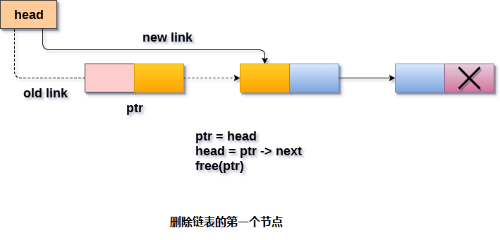

# 单链表 删除第一个节点

节点，只需要创建头节点，然后指向下一个头节点。 这将通过使用以下语句来完成。

```c
ptr = head;  
head = ptr->next;
```

现在，释放指向链表头节点的指针`ptr`。 这将通过使用以下语句来完成。

```c
free(ptr);
```

**步骤**

```
第1步：IF HEAD = NULL
提示“下溢”
     转到第5步
     [结束]

第2步：设置PTR = HEAD
第3步：SET HEAD = HEAD - > NEXT
第4步：释放PTR
第5步：退出
```

图示 -


## C语言实现的示例代码

文件名:linked-list-single-deletion-at-head.c

```c
#include<stdio.h>  
#include<stdlib.h>  
void create(int);
void begdelete();
struct node
{
    int data;
    struct node *next;
};
struct node *head;
void main()
{
    int choice, item;
    do
    {
        printf("1.Append List\n");
        printf("2.Delete node\n");
        printf("3.Exit\n");
        printf("4.Enter your choice ? ");
        scanf("%d", &choice);
        switch (choice)
        {
        case 1:
            printf("\nEnter the item\n");
            scanf("%d", &item);
            create(item);
            break;
        case 2:
            begdelete();
            break;
        case 3:
            exit(0);
            break;
        default:
            printf("\nPlease enter valid choice\n");
        }

    } while (choice != 3);
}
void create(int item)
{
    struct node *ptr = (struct node *)malloc(sizeof(struct node *));
    if (ptr == NULL)
    {
        printf("\nOVERFLOW\n");
    }
    else
    {
        ptr->data = item;
        ptr->next = head;
        head = ptr;
        printf("\nNode inserted\n");
    }

}
void begdelete()
{
    struct node *ptr;
    if (head == NULL)
    {
        printf("\nList is empty");
    }
    else
    {
        ptr = head;
        head = ptr->next;
        free(ptr);
        printf("\n Node deleted from the begining ...");
    }
}
```

```bash
gcc /share/lesson/data-structure/linked-list-single-deletion-at-head.c && ./a.out
```

康康