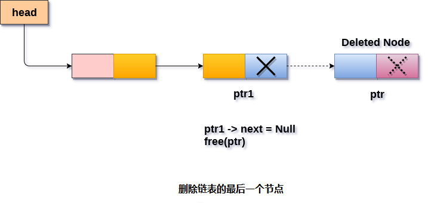

# 单链表 删除最后一个节点

从链表的末尾删除节点，有两种情况。

- 链表中只有一个节点，需要删除。
- 链表中有多个节点，链表的最后一个节点将被删除。

#### 1. 链表中只有一个节点

条件`head → next = NULL`将继续存在，因此，链表的唯一节点`head`将被指定为`null`。 这将通过使用以下语句来完成。

```c
ptr = head;
head = NULL;
free(ptr);
```

#### 2. 链表中有多个节点

条件`head→next = NULL`将失败，因此，必须遍历节点才能到达链表的最后一个节点。
为此，只需声明一个临时指针`temp`并将其指定给链表的头部。还需要跟踪链表的倒数第二个节点。所以使用两个指针`ptr`和`ptr1`，其中`ptr`将指向最后一个节点，`ptr1`将指向链表的倒数第二个节点。通过使用以下语句来完成。

```c
ptr = head;   
while(ptr->next != NULL)  
{  
    ptr1 = ptr;  
    ptr = ptr ->next;  
}
```

现在，只需要使指针`ptr1`指向下一个节点为`NULL`，并且`ptr`将变释放。它将通过使用以下语句来完成。

```c
ptr1->next = NULL;  
free(ptr);
```

**算法**

```
第1步：IF HEAD = NULL
打印内存溢出。
    转到第8步
   [结束]

第2步：设置PTR = HEAD
第3步：重复第4步和第5步，同时PTR - > NEXT！= NULL
第4步：SET PREPTR = PTR
第5步：SET PTR = PTR - > NEXT
[循环结束]

第6步：SET PREPTR - > NEXT = NULL
第7步：释放PTR
第8步：退出
```

示意图 - 



## C语言实现的示例代码

文件名:linked-list-single-deletion-at-tail.c

```c
#include<stdio.h>  
#include<stdlib.h>  
void create(int);
void end_delete();
struct node
{
    int data;
    struct node *next;
};
struct node *head;
void main()
{
    int choice, item;
    do
    {
        printf("1.Append List\n");
        printf("2.Delete node\n");
        printf("3.Exit\n");
        printf("4.Enter your choice ? ");
        scanf("%d", &choice);
        switch (choice)
        {
        case 1:
            printf("\nEnter the item\n");
            scanf("%d", &item);
            create(item);
            break;
        case 2:
            end_delete();
            break;
        case 3:
            exit(0);
            break;
        default:
            printf("\nPlease enter valid choice\n");
        }

    } while (choice != 3);
}
void create(int item)
{
    struct node *ptr = (struct node *)malloc(sizeof(struct node *));
    if (ptr == NULL)
    {
        printf("\nOVERFLOW\n");
    }
    else
    {
        ptr->data = item;
        ptr->next = head;
        head = ptr;
        printf("\nNode inserted\n");
    }

}
void end_delete()
{
    struct node *ptr, *ptr1;
    if (head == NULL)
    {
        printf("\nlist is empty");
    }
    else if (head->next == NULL)
    {
        head = NULL;
        free(head);
        printf("\nOnly node of the list deleted ...");
    }

    else
    {
        ptr = head;
        while (ptr->next != NULL)
        {
            ptr1 = ptr;
            ptr = ptr->next;
        }
        ptr1->next = NULL;
        free(ptr);
        printf("\n Deleted Node from the last ...");
    }
}
```

```bash
gcc /share/lesson/data-structure/linked-list-single-deletion-at-tail.c && ./a.out
```

康康