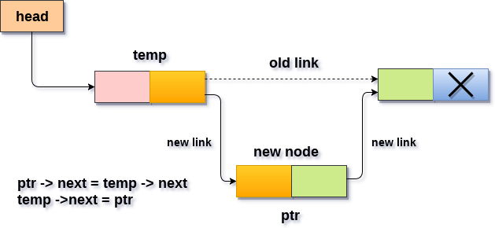

# 单链表 在指定节点之后插入节点

要在指定的节点之后将新节点插入到链表中，需要跳过链表中所需数量的节点，以将指针移动到插入节点之后的位置。通过使用以下语句来完成。

```c
emp = head;
for (i = 0;i < loc;i++)
{
    temp = temp->next;
    if (temp == NULL)
    {
        return;
    }

}
```

为新节点分配空间，并将数据项添加到节点的数据部分。这将通过使用以下语句来完成。

```c
ptr = (struct node *) malloc (sizeof(struct node));  
ptr->data = item;
```

现在，只需要进行一些链接调整，将节点插入到指定的位置。 因为，在循环结束时，循环指针`temp`将指向将插入新节点的节点。 因此，新节点`ptr`的下一部分必须包含`temp`的下一部分的地址(因为，`ptr`将在`temp`和`temp`的下一个节点之间)。 这将通过使用以下语句来完成。

```c
ptr -> next = temp -> next;
```

现在，只需要创建`temp`的下一部分，指向新节点`ptr`。 这将在指定位置插入新节点`ptr`。

```c
temp ->next = ptr;
```

**算法**

```
步骤1：如果 PTR = NULL
输出 OVERFLOW 提示
    转到第12步
   结束时间

第2步：设置 NEW_NODE = PTR
第3步：NEW_NODE→DATA = VAL
第4步：设置 TEMP = HEAD
第5步：设置 I = 0
第6步：重复第5步和第6步直到 I 
第7步：TEMP = TEMP→NEXT
第8步：如果 TEMP = NULL
输出 “希望不存在的节点” 提示
     转到第12步
    结束时间
  循环结束

第9步：PTR→NEXT = TEMP→NEXT
第10步：TEMP→NEXT = PTR
第11步：设置 PTR = NEW_NODE
第12步：退出
```



## C语言实现的示例代码

文件名:linked-list-single-insertion-after-specified-node.c

```c
#include<stdio.h>  
#include<stdlib.h>  
void randominsert(int);
void create(int);
struct node
{
    int data;
    struct node *next;
};
struct node *head;
void main()
{
    int choice, item, loc;
    do
    {
        printf("\nEnter the item which you want to insert?\n");
        scanf("%d", &item);
        if (head == NULL)
        {
            create(item);
        }
        else
        {
            randominsert(item);
        }
        printf("\nPress 0 to insert more ?\n");
        scanf("%d", &choice);
    } while (choice == 0);
}
void create(int item)
{

    struct node *ptr = (struct node *)malloc(sizeof(struct node *));
    if (ptr == NULL)
    {
        printf("\nOVERFLOW\n");
    }
    else
    {
        ptr->data = item;
        ptr->next = head;
        head = ptr;
        printf("\nNode inserted\n");
    }
}
void randominsert(int item)
{
    struct node *ptr = (struct node *) malloc(sizeof(struct node));
    struct node *temp;
    int i, loc;
    if (ptr == NULL)
    {
        printf("\nOVERFLOW");
    }
    else
    {

        printf("Enter the location");
        scanf("%d", &loc);
        ptr->data = item;
        temp = head;
        for (i = 0;i < loc;i++)
        {
            temp = temp->next;
            if (temp == NULL)
            {
                printf("\ncan't insert\n");
                return;
            }

        }
        ptr->next = temp->next;
        temp->next = ptr;
        printf("\nNode inserted");
    }

}
```

```bash
gcc /share/lesson/data-structure/linked-list-single-insertion-after-specified-node.c && ./a.out
```

康康