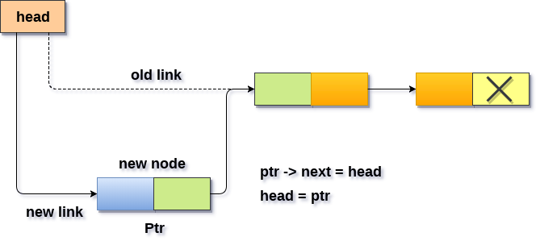

# 单链表 开头插入节点

在链表的开头将新元素插入节点非常简单，只需要在节点链接中进行一些调整。要在开始时在链表中加入新节点，需要遵循以下步骤。

- 为新节点分配空间并将数据存储到节点的数据部分。这将通过以下声明完成。

  ```c
  ptr = (struct node *) malloc(sizeof(struct node *));  
  ptr -> data = data_item;
  ```

- 使新节点的链接部分指向链表的现有第一个节点。这将通过使用以下语句来完成。

  ```c
  ptr->next = head;
  ```

- 最后，需要将新节点作为链表的第一个节点，这将通过使用以下语句来完成。

  ```c
  head = ptr;
  ```

**算法**

```
第1步：IF PTR = NULL
     则写 OVERFLOW
     转到步骤7
     [结束]

第2步：设置 NEW_NODE = PTR
第3步：SET PTR = PTR→NEXT
第4步：设置 NEW_NODE→DATA = VAL
第5步：设置NEW_NODE→NEXT = HEAD
第6步：SET HEAD = NEW_NODE
第7步：退出
```




## C语言实现的示例代码

文件名:linked-list-single-insertion-at-head.c

```c
#include<stdio.h>  
#include<stdlib.h>  

void beginsert(int);

struct node
{
    int data;
    struct node *next;
};
struct node *head;
void main()
{
    int choice, item;
    do
    {
        printf("Enter the item which you want to insert?\n");
        scanf("%d", &item);
        beginsert(item);
        printf("\nPress 0 to insert more ?\n");
        scanf("%d", &choice);
    } while (choice == 0);
}
void beginsert(int item)
{
    struct node *ptr = (struct node *)malloc(sizeof(struct node *));
    if (ptr == NULL)
    {
        printf("\nOVERFLOW\n");
    }
    else
    {
        ptr->data = item;
        ptr->next = head;
        head = ptr;
        printf("\nNode inserted\n");
    }

}
```

```bash
gcc /share/lesson/data-structure/linked-list-single-insertion-at-head.c && ./a.out
```

康康