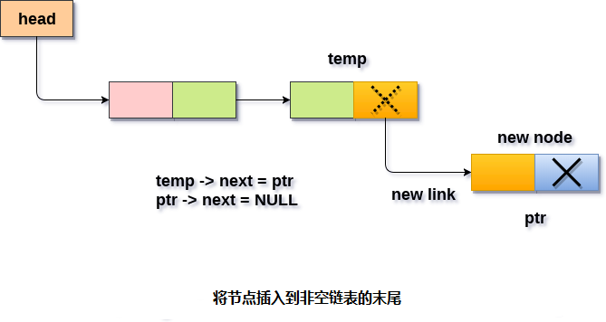

# 单链表 在最后插入节点

要在单链表的最后插入节点，需要提及以下两种情况。

- 新节点添加到空链表中
- 新节点添加到链表的末尾

#### 1. 新节点添加到空链表中

如果满足条件(`head == NULL`)。 因此，只需要在C语言中使用`malloc`语句为新节点分配空间。数据和节点的链接部分通过使用以下语句来设置。

```c
ptr->data = item;  
ptr -> next = NULL;
```

因为，`ptr`是插入链表中的唯一节点，因此需要使链表的头指针指向这个新节点，通过使用以下语句来完成。

```c
Head = ptr
```

#### 2. 新节点添加到链表的末尾

如果条件`head = NULL`失败，因为`head`不为`null`。需要声明一个临时指针`temp`才能遍历链表。`temp`指向链表的第一个节点。

```c
temp = head
```

然后，使用以下语句遍历整个链表：

```c
while (temp -> next != NULL){
    temp = temp -> next;
}
```

在循环结束时，`temp`将指向链表的最后一个节点。 现在，为新节点分配空间，并将项目分配给其数据部分。 因为，新节点将成为链表的最后一个节点，因此新节点下一链接部分需要指向`null`。 使`temp`节点的下一链接部分(当前是链表的最后一个节点)指向新节点(`ptr`)。

```c
temp = head;  
while (temp -> next != NULL)  
{  
    temp = temp -> next;  
}  
temp->next = ptr;  
ptr->next = NULL;
```

**算法**

```c
第1步：IF PTR = NULL
写OVERFLOW
    转到第1步
   [结束]

第2步：设置NEW_NODE = PTR
第3步：SET PTR = PTR - > NEXT
第4步：设置NEW_NODE - > DATA = VAL
第5步：设置NEW_NODE - > NEXT = NULL
第6步：设置PTR = HEAD
第7步：重复第8步，同时PTR - > NEXT != NULL
第8步：SET PTR = PTR - > NEXT
[循环结束]

第9步：SET PTR - > NEXT = NEW_NODE
第10步：退出
```



## C语言实现的示例代码

文件名:linked-list-single-insertion-at-tail.c

```c
#include<stdio.h>  
#include<stdlib.h>  
void lastinsert(int);
struct node
{
    int data;
    struct node *next;
};
struct node *head;
void main()
{
    int choice, item;
    do
    {
        printf("\nEnter the item which you want to insert?\n");
        scanf("%d", &item);
        lastinsert(item);
        printf("\nPress 0 to insert more ?\n");
        scanf("%d", &choice);
    } while (choice == 0);
}
void lastinsert(int item)
{
    struct node *ptr = (struct node*)malloc(sizeof(struct node));
    struct node *temp;
    if (ptr == NULL)
    {
        printf("\nOVERFLOW");
    }
    else
    {
        ptr->data = item;
        if (head == NULL)
        {
            ptr->next = NULL;
            head = ptr;
            printf("\nNode inserted");
        }
        else
        {
            temp = head;
            while (temp->next != NULL)
            {
                temp = temp->next;
            }
            temp->next = ptr;
            ptr->next = NULL;
            printf("\nNode inserted");

        }
    }
}
```

```bash
gcc /share/lesson/data-structure/linked-list-single-insertion-at-tail.c && ./a.out
```

康康