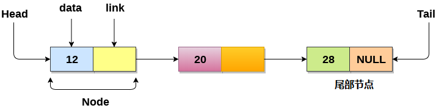

# 链表 			

链表是一种随机存储在内存中的叫做节点的对象集合。
节点包含两个字段，即存储在该地址的数据和包含下一个节点地址的指针。
链表的最后一个节点包含指向`null`的指针。

## 链表的用途

- 链表不需要连续存在于存储器中。节点可以是存储器中的任何位置并链接在一起以形成链表。这实现了空间的优化利用。
- 链表大小仅限于内存大小，不需要提前声明。
- 空节点不能出现在链表中。
- 在单链表中存储基元类型或对象的值。

## 为什么链表比数组有优势？

到目前为止，学习了如何使用数组数据结构来组织要在内存中单独存储的元素组。 但是，数组有几个优点和缺点，必须知道这些优点和缺点才能确定将在整个程序中使用的什么样类型的数据结构。

数组有以下限制：

- 在程序中使用数组之前，必须事先知道数组的大小。
- 增加数组的大小是一个耗时的过程。在运行时几乎不可能扩展数组的大小。
- 数组中的所有元素都需要连续存储在内存中。在数组中插入任何元素都需要移动元素之前所有的数据。

链表是可以克服数组所有限制的数据结构。 链表是非常有用的，因为，

- 它动态分配内存。链表的所有节点都是非连续存储在存储器中，并使用指针链接在一起。
- 大小调整不再是问题，因为不需要在声明时定义大小。链表根据程序的需求增长，并且仅限于可用的内存空间。