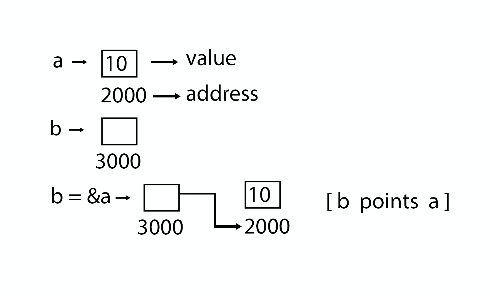

# 指针

指针用于指向存储在计算机内存中任何位置的值的地址。获取存储在该位置的值称为解除引用指针。指针提高了重复过程的性能，例如：

- 遍历字符串
- 查找表
- 控制表
- 树结构

## 指针详细信息

- **指针算术**：指针中有四个算术运算符：`++`， `--` ，`+`，`-`
- **指针数组**：可以定义数组以容纳多个指针。
- **指针的指针**：C语言允许指针的指针等等。
- **将指针传递给C语言的函数**：通过引用或地址传递参数使得被调用函数可以在调用函数中更改传递的参数。
- **从C语言函数返回指针**：允许函数返回指向局部变量，静态变量和动态分配内存的指针。



**指针示例程序**

文件名:pointer.c

```c
#include <stdio.h>  

int main()
{
    int a = 5;
    int *b;
    b = &a;

    printf("value of a = %d\n", a);
    printf("value of a = %d\n", *(&a));
    printf("value of a = %d\n", *b);
    printf("address of a = %u\n", &a);
    printf("address of a = %d\n", b);
    printf("address of b = %u\n", &b);
    printf("value of b = address of a = %u", b);
    return 0;
}

```

```bash
gcc /share/lesson/data-structure/pointer.c -Wformat=0
./a.out
```

康康

**指针的指针示例程序**

文件名:pointer2pointer.c

```c
#include <stdio.h>  

int main()
{
    int a = 5;
    int *b;
    int **c;
    b = &a;
    c = &b;
    printf("value of a = %d\n", a);
    printf("value of a = %d\n", *(&a));
    printf("value of a = %d\n", *b);
    printf("value of a = %d\n", **c);
    printf("value of b = address of a = %u\n", b);
    printf("value of c = address of b = %u\n", c);
    printf("address of a = %u\n", &a);
    printf("address of a = %u\n", b);
    printf("address of a = %u\n", *c);
    printf("address of b = %u\n", &b);
    printf("address of b = %u\n", c);
    printf("address of c = %u\n", &c);
    return 0;
}
```

```bash
gcc /share/lesson/data-structure/pointer2pointer.c -Wformat=0
./a.out
```

康康


> **编译参数 -Wformat的说明:** 
>
> ```
> NOTE: In Ubuntu 8.10 and later versions this option is enabled by default for C, C++, ObjC, ObjC++.  To disable, use -Wformat=0.
> ```
>
> Wformat这个配置在Ubuntu系统上默认是打开的。
>
> http://manpages.ubuntu.com/manpages/oneiric/en/man1/gcc.1.html

