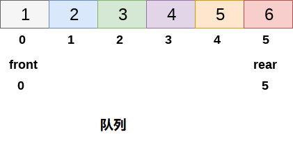
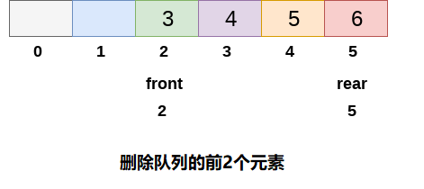

# 循环队列

线性队列而言，删除和插入只能分别在前端(`front`)和后端(`rear`)执行。考虑下图中显示的队列。



上图中显示的队列已完全填满，由于条件`rear == max - 1`变为真，因此无法再插入任何元素。
但是，如果删除队列前端的`2`个元素，仍然无法插入任何元素，因为条件`rear = max -1`仍然成立。

这是线性队列的主要问题，虽然在数组中有空间可用，但是不能在队列中插入任何更多的元素。这只是内存浪费，需要克服这个问题。



这个问题的解决方案之一是循环队列。

在循环队列中，第一个索引紧跟在最后一个索引之后。 可以考虑循环队列，如下图所示。


当`front = -1`和`rear = max-1`时，循环队列将满。循环队列的实现类似于线性队列的实现。只有在插入和删除的情况下实现的逻辑部分与线性队列中的逻辑部分不同。

**时间复杂性** 

| 操作      |      |
| --------- | ---- |
| Front     | O(1) |
| Rear      | O(1) |
| enQueue() | O(1) |
| deQueue() | O(1) |

#### 1. 插入循环队列

在队列中插入元素有三种情况。

- `If (rear + 1)%maxsize = front`, 队列已满。在这种情况下，发生溢出，因此无法在队列中执行插入。
- `If rear != max - 1`, 然后`rear`将增加到 `mod(maxsize)`，新值将插入队列的后端。
- `If front != 0 and rear = max - 1`, 那么这意味着队列未满，因此将`rear`的值设置为`0`并在那里插入新元素。

**在循环队列中插入元素的算法**

```
第1步 : IF (REAR+1)%MAX = FRONT
    提示 " OVERFLOW "
    转到第4步
    [End OF IF]
第2步 : IF FRONT = -1 and REAR = -1
    SET FRONT = REAR = 0
    ELSE IF REAR = MAX - 1 and FRONT ! = 0
    SET REAR = 0
    ELSE
    SET REAR = (REAR + 1) % MAX
    [END OF IF]
第3步 : SET QUEUE[REAR] = VAL
第4步 : EXIT
```

C语言实现代码如下所示 - 

```c
void insert(int item, int queue[])  
{  
    if((rear+1)%maxsize == front)  
    {  
        printf("OVERFLOW");  
        return;  
    }  
    else if(front == -1 && rear == -1)  
    {  
        front = 0;  
        rear = 0;  
    }else if(rear == maxsize -1 && front != 0)   
    {  
        rear = 0;  
    }else   
    {  
        rear = (rear+1)%maxsize;  
    }  
    queue[rear] = item;  
}
```

#### 2. 从循环队列中删除元素的算法

要从循环队列中删除元素，必须检查以下三个条件。

- 如果`front = -1`，那么队列中没有元素，因此这将是下溢情况。
- 如果队列中只有一个元素，在这种情况下，条件`rear = front`为真，因此，两者都设置为`-1`并且队列被完全删除。
- 如果`front = max -1`则从前端删除该值，将`front`的值设置为`0`。
- 否则，`front`的值增加`1`，然后删除前端的元素。

**算法**

```
第1步：IF FRONT = -1
    提示 “UNDERFLOW”
    转到第4步
    [IF结束]
第2步：设置VAL = QUEUE [FRONT]
第3步：如果FRONT = REAR
    SET FRONT = REAR = -1
    其他
    IF FRONT = MAX -1
    SET FRONT = 0
    其他
    SET FRONT = FRONT + 1
    [IF结束]
  [结束]
第4步：退出
```


## C语言实现的示例代码

文件名:queue-circular.c

```c
#include<stdio.h>   
#include<stdlib.h>  
#define maxsize 5  
void insert();
void delete();
void display();
int front = -1, rear = -1;
int queue[maxsize];
void main()
{
    int choice;
    while (choice != 4)
    {
        printf("*************************Main Menu*****************************\n");
        printf("=================================================================\n");
        printf("1.insert an element\n2.Delete an element\n3.Display the queue\n4.Exit\n");
        printf("Enter your choice ?");
        scanf("%d", &choice);
        switch (choice)
        {
        case 1:
            insert();
            break;
        case 2:
            delete();
            break;
        case 3:
            display();
            break;
        case 4:
            exit(0);
            break;
        default:
            printf("Enter valid choice??\n");
        }
    }
}
void insert()
{
    int item;
    printf("Enter the element\n");
    scanf("%d", &item);
    if ((rear + 1) % maxsize == front)
    {
        printf("OVERFLOW");
        return;
    }
    else if (front == -1 && rear == -1)
    {
        front = 0;
        rear = 0;
    }
    else if (rear == maxsize - 1 && front != 0)
    {
        rear = 0;
    }
    else
    {
        rear = (rear + 1) % maxsize;
    }
    queue[rear] = item;
    printf("Value inserted ");
}
void delete()
{
    int item;
    if (front == -1 & rear == -1)
    {
        printf("UNDERFLOW\n");
        return;
    }
    else if (front == rear)
    {
        front = -1;
        rear = -1;
    }
    else if (front == maxsize - 1)
    {
        front = 0;
    }
    else
        front = front + 1;
}

void display()
{
    int i;
    if (front == -1)
        printf("Circular Queue is Empty!!!\n");
    else
    {
        i = front;
        printf("Circular Queue Elements are : \n");
        if (front <= rear) {
            while (i <= rear)
                printf("%d %d %d\n", queue[i++], front, rear);
        }
        else {
            while (i <= maxsize - 1)
                printf("%d %d %d\n", queue[i++], front, rear);
            i = 0;
            while (i <= rear)
                printf("%d %d %d\n", queue[i++], front, rear);
        }
    }
}
```

```bash
gcc /share/lesson/data-structure/queue-circular.c && ./a.out
```

康康