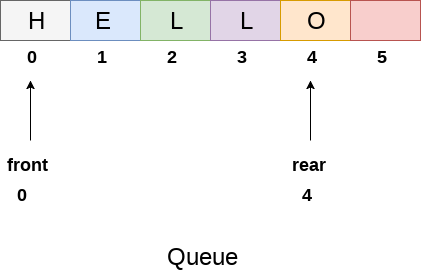
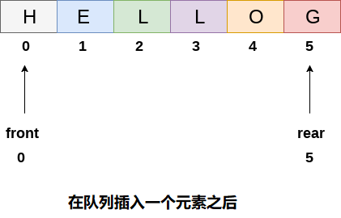
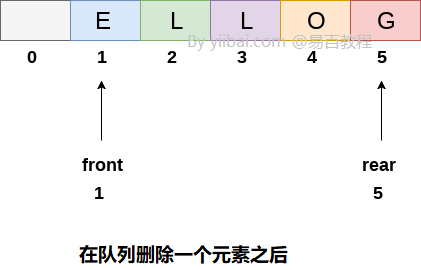
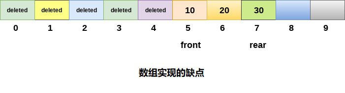

# 队列 数组实现队列

使用线性数组可以很容易地表示队列。 在每个队列的情况下实现有两个变量，即前面(`front`)和后面(`rear`)。 前后变量指向队列中执行插入和删除的位置。 

最初，`front`和`queue`的值为`-1`，表示空队列。 包含`5`个元素的队列的数组表示以及前后的值如下图所示。



上图显示了形成英文单词`“HELLO”`的字符队列。 因为，到目前为止在队列中没有执行删除报操作，因此`font`的值保持为`0`。 但是，每次在队列中执行插入时，`rear`的值都会增加`1`。 将元素插入上图所示的队列后，队列将如下所示。 `rear`的值将变为`5`，而`font`的值保持不变。



删除一个元素后，`front`的值将从`0`增加到`1`。当前，队列内容将类似于如下。



## 1. 在队列中插入元素的算法

通过将`rear`与`max - 1`进行比较来检查队列是否已满，如果是，则返回溢出错误。
如果要将数据项作为列表中的第一个元素插入，则在这种情况下将前后值设置为`0`并将元素插入后端。否则继续增加`rear`的值并逐个插入每个元素，使用`rear`作为索引。

**算法**

```
第1步：IF REAR = MAX - 1
    写OVERFLOW
    转到第4步
    [IF结束]
第2步：IF FRONT = -1且REAR = -1
    SET FRONT = REAR = 0
    其他
    SET REAR = REAR + 1
    [IF结束]
第3步：设置QUEUE [REAR] = NUM
第4步：退出
```

使用C语言实现以下算法如下所示 - 

```c
void insert (int queue[], int max, int front, int rear, int item)   
{  
    if (rear + 1 == max)  
    {  
        printf("overflow");  
    }  
    else  
    {  
        if(front == -1 && rear == -1)  
        {  
            front = 0;  
            rear = 0;  
        }  
        else  
        {  
            rear = rear + 1;   
        }  
        queue[rear]=item;  
    }  
}
```

## 2. 从队列中删除元素的算法

如果`front`的值为`-1`或`front`的值大于`rear`，则提示下溢信息并退出。
否则，继续增加前后的值并每次返回存储在队列前端的数据项。

**算法**

```
第1步：IF FRONT = -1或FRONT> REAR
    提示溢出
    其他
    SET VAL = QUEUE [FRONT]
    SET FRONT = FRONT + 1
    [IF结束]
第2步：退出
```

C语言实现算法，如下所示 - 

```c
int delete (int queue[], int max, int front, int rear)  
{  
    int y;   
    if (front == -1 || front > rear)   

    {  
        printf("underflow");  
    }  
    else   
    {  
        y = queue[front];  
        if(front == rear)  
        {  
            front = rear = -1;  
            else   
            front = front + 1;   

        }  
        return y;  
    }  
}
```


## C语言实现的完整示例代码

文件名:queue-implementation-with-array.c

```c
#include<stdio.h>   
#include<stdlib.h>  
#define maxsize 5  
void insert();
void delete();
void display();
int front = -1, rear = -1;
int queue[maxsize];
void main()
{
    int choice;
    while (choice != 4)
    {
        printf("*************************Main Menu*****************************\n");
        printf("=================================================================\n");
        printf("1.insert an element\n2.Delete an element\n3.Display the queue\n4.Exit\n");
        printf("Enter your choice ?");
        scanf("%d", &choice);
        switch (choice)
        {
        case 1:
            insert();
            break;
        case 2:
            delete();
            break;
        case 3:
            display();
            break;
        case 4:
            exit(0);
            break;
        default:
            printf("Enter valid choice??\n");
        }
    }
}
void insert()
{
    int item;
    printf("\nEnter the element\n");
    scanf("\n%d", &item);
    if (rear == maxsize - 1)
    {
        printf("OVERFLOW\n");
        return;
    }
    if (front == -1 && rear == -1)
    {
        front = 0;
        rear = 0;
    }
    else
    {
        rear = rear + 1;
    }
    queue[rear] = item;
    printf("Value inserted ");

}
void delete()
{
    int item;
    if (front == -1 || front > rear)
    {
        printf("UNDERFLOW\n");
        return;

    }
    else
    {
        item = queue[front];
        if (front == rear)
        {
            front = -1;
            rear = -1;
        }
        else
        {
            front = front + 1;
        }
        printf("value deleted ");
    }


}

void display()
{
    int i;
    if (rear == -1)
    {
        printf("Empty queue\n");
    }
    else
    {
        printf("printing values .....\n");
        for (i = front;i <= rear;i++)
        {
            printf("\n%d\n", queue[i]);
        }
    }
}
```

```bash
gcc /share/lesson/data-structure/queue-implementation-with-array.c && ./a.out
```

康康 


## 3. 数组实现的缺点

虽然，创建队列很容易，但是使用这种技术来实现队列存在一些缺点。

- **内存浪费**：数组的空间(用于存储队列元素)永远不能被重用来存储该队列的元素，因为元素只能插入前端而前面的值可能很高，所以， 在此之前的所有空间，永远不会被填补。


  上图显示了如何在队列的数组表示中浪费内存空间。 在上图中，示出了具有`3`个元素的大小为`10`的队列。 `front`变量的值为`5`，因此，不能将值重新插入`front`位置之前已删除元素的位置。 数组的那么多空间被浪费了，以后不能使用(对于这个队列)。
- **确定数组大小**
  关于数组实现的最常见问题是需要事先声明的数组的大小。 由于队列可以在运行时根据问题进行扩展，因此数组大小的扩展是一个耗时的过程，并且由于发生了大量的重新分配，因此几乎不可能在运行时执行。 由于这个原因，要声明数组足够大，以便可以尽可能地存储队列元素，但这个声明的主要问题是，大多数数组插槽(接近一半)永远不能被重用。 它将再次导致内存浪费。
