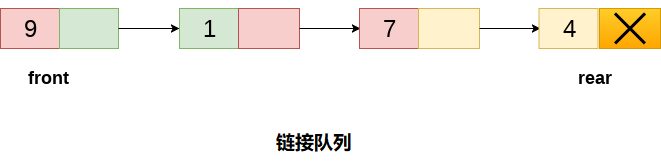

# 队列 链表实现队列			

本教程前一节中讨论了数组实现队列的缺点，数组实现不能用于实现队列的大规模应用程序。数组实现的替代方法之一是队列的链表实现。

具有`n`个元素的队列的链接表示的存储要求是*o(n)*，而操作的时间要求是*o(1)*。

在链接队列中，队列的每个节点由两部分组成，即数据部分和链接部分。队列的每个元素都指向内存中的紧邻下一个元素。

在链接队列中，在存储器中保持两个指针，即`front`指针和`rear`指针。`front`指针包含队列的起始元素的地址，而`rear`指针包含队列的最后一个元素的地址。

插入和删除分别在后端和前端执行。如果`front`和`rear`指针都是`NULL`，则表示队列为空。

队列的链接表示如下图所示。



## 链接队列上的操作

可以在链接队列上实现两种基本操作。操作是插入和删除。

#### 1. 插入操作

插入操作通过向队列末尾添加元素来追加队列。新元素将是队列的最后一个元素。
首先，使用以下语句为新节点`ptr`分配内存。

```c
ptr = (struct node *) malloc (sizeof(struct node));
```

存在将此新节点`ptr`插入链接队列的两种情况。

**第1种情况**，将元素插入到空队列中。 在这种情况下，条件`front = NULL`变为`true`。 现在，新元素将作为队列的唯一元素添加，前后指针的下一个指针都将指向`NULL`。

```c
ptr -> data = item;  
if(front == NULL)  
{  
    front = ptr;  
    rear = ptr;    
    front -> next = NULL;  
    rear -> next = NULL;  
}
```

**第2种情况**，队列包含多个元素。 条件`front = NULL`变为`false`。 在这种情况下，需要更新`rear`指针，以便`rear`的下一个指针指向新节点`ptr`。 因为，这是一个链接队列，因此还需要使`rear`指针指向新添加的节点`ptr`。 还需要将`rear`的`next`指针设为`NULL`。

```c
rear -> next = ptr;  
rear = ptr;  
rear->next = NULL;
```

通过这种方式，元素被插入队列中。 算法和C实现如下。

**算法**

```
第2步：为新节点PTR分配空间
第2步：设置PTR - > DATA = VAL
第3步：IF FRONT = NULL
    SET FRONT = REAR = PTR
    SET FRONT - > NEXT = REAR - > NEXT = NULL
    其他
    SET REAR - > NEXT = PTR
    SET REAR = PTR
    SET REAR - > NEXT = NULL
    [结束]
第4步：结束
```

**C语言的实现**

```c
void insert(struct node *ptr, int item; )  
{
    ptr = (struct node *) malloc (sizeof(struct node));  
    if(ptr == NULL)  
    {  
        printf("OVERFLOW\n");  
        return;  
    }else  
    {   
        ptr -> data = item;  
        if(front == NULL)  
        {  
            front = ptr;  
            rear = ptr;   
            front -> next = NULL;  
            rear -> next = NULL;  
        }else
        {  
            rear -> next = ptr;  
            rear = ptr;  
            rear->next = NULL;  
        }  
    }  
}
```

#### 2. 删除

删除操作将删除在队列所有元素中第一个插入的元素。 首先，需要检查链表是否为空。 如果链表为空，则条件`front == NULL`变为`true`，在这种情况下，只需在控制台上编写下溢并退出。

否则，将删除指针前面指向的元素。 为此，将前指针指向的节点复制到指针`ptr`中。 现在，移动`front`指针，指向下一个节点并释放节点`ptr`指向的节点。通过使用以下语句完成。

```c
ptr = front;  
front = front -> next;  
free(ptr);
```

算法和C语言函数给出如下 - 

```
第1步：IF FRONT = NULL
    提示“下溢”
    转到第5步
    [结束]
第2步：设置PTR = FRONT
第3步：SET FRONT = FRONT - > NEXT
第4步：释放PTR
第5步：结束
```

C语言实现代码 - 

```c
void delete (struct node *ptr)  
{  
    if(front == NULL)  
    {  
        printf("UNDERFLOW\n");  
        return;  
    }  
    else   
    {  
        ptr = front;  
        front = front -> next;  
        free(ptr);  
    }  
}
```

## 完整的C语言实现代码如下所示

文件名:queue-implementation-with-linkedlist.c

```c
#include<stdio.h>   
#include<stdlib.h>  
struct node
{
    int data;
    struct node *next;
};
struct node *front;
struct node *rear;
void insert();
void delete();
void display();
void main()
{
    int choice;
    while (choice != 4)
    {
        printf("*************************Main Menu*****************************\n");
        printf("=================================================================\n");
        printf("1.insert an element\n2.Delete an element\n3.Display the queue\n4.Exit\n");
        printf("Enter your choice ?");
        scanf("%d", &choice);
        switch (choice)
        {
        case 1:
            insert();
            break;
        case 2:
            delete();
            break;
        case 3:
            display();
            break;
        case 4:
            exit(0);
            break;
        default:
            printf("Enter valid choice??\n");
        }
    }
}
void insert()
{
    struct node *ptr;
    int item;

    ptr = (struct node *) malloc(sizeof(struct node));
    if (ptr == NULL)
    {
        printf("OVERFLOW\n");
        return;
    }
    else
    {
        printf("Enter value?\n");
        scanf("%d", &item);
        ptr->data = item;
        if (front == NULL)
        {
            front = ptr;
            rear = ptr;
            front->next = NULL;
            rear->next = NULL;
        }
        else
        {
            rear->next = ptr;
            rear = ptr;
            rear->next = NULL;
        }
    }
}
void delete ()
{
    struct node *ptr;
    if (front == NULL)
    {
        printf("UNDERFLOW\n");
        return;
    }
    else
    {
        ptr = front;
        front = front->next;
        free(ptr);
    }
}
void display()
{
    struct node *ptr;
    ptr = front;
    if (front == NULL)
    {
        printf("Empty queue\n");
    }
    else
    {
        printf("printing values .....\n");
        while (ptr != NULL)
        {
            printf("%d\n", ptr->data);
            ptr = ptr->next;
        }
    }
}
```

```bash
gcc /share/lesson/data-structure/queue-implementation-with-linkedlist.c && ./a.out
```

康康