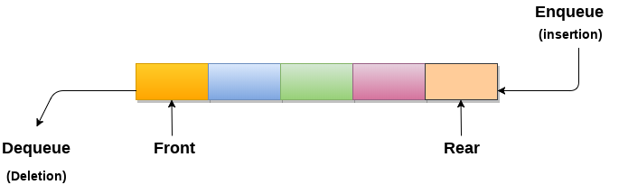

# 队列(queue)

**队列的简介**

- 队列可以定义为有序列表，它允许在一端执行插入操作，称为`REAR`，删除操作在另一端执行，称为`FRONT`。
- 队列被称为先进先出列表。
- 例如，排队等候铁路车票的人队列。

#### 队列的应用

由于队列以先进先出的方式执行操作，这对于操作的排序是相当公平的。 队列的各种应用如下所述。

- 队列被广泛用作单个共享资源(如打印机，磁盘，CPU)的等待列表。
- 队列用于异步数据传输(例如，数据不以两个进程之间的相同速率传输)。 管道，文件IO，套接字。
- 队列在大多数应用程序中用作缓冲区，如MP3媒体播放器，CD播放器等。
- 队列用于维护媒体播放器中的播放列表，以便添加和删除播放列表中的歌曲。
- 队列在操作系统中用于处理中断。

**时间复杂性**

| 时间复杂性 | 访问 | 搜索 | 插入 | 删除 |
| ---------- | ---- | ---- | ---- | ---- |
| 平均情况   | θ(n) | θ(n) | θ(1) | θ(1) |
| 最坏情况   | θ(n) | θ(n) | θ(1) | θ(1) |

