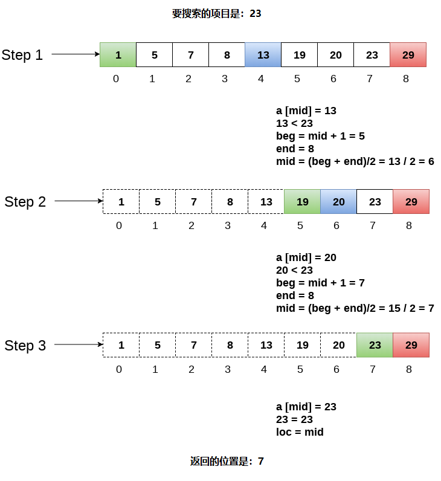

# 搜索(二分查找)		

二进制搜索是一种在排序列表上有效工作的搜索技术。 因此，要使用二进制搜索技术来搜索某个列表中的元素，需要确保对列表是一个已排好顺序。

二进制搜索遵循分而治之的方法，其中，列表被分成两半，并且项目与列表的中间元素进行比较。 如果找到匹配，则返回中间元素的位置，否则根据匹配产生的结果搜索到两半中的任何一个。

二进制搜索算法如下。

```
BINARY_SEARCH(A, lower_bound, upper_bound, VAL)
第1步: [INITIALIZE] SET BEG = lower_bound
    END = upper_bound, POS = - 1
第2步: Repeat Steps 3 and 4 while BEG <=END
第3步: SET MID = (BEG + END)/2
第4步: IF A[MID] = VAL
    SET POS = MID
    PRINT POS
转到第6步
    ELSE IF A[MID] > VAL
    SET END = MID - 1
    ELSE
    SET BEG = MID + 1
    [END OF IF]
    [END OF LOOP]
第5步: IF POS = -1
    PRINT "VALUE IS NOT PRESENT IN THE ARRAY"
    [END OF IF]
第6步: EXIT
```

**复杂度**

| 编号 | 性能               | 复杂性   |
| ---- | ------------------ | -------- |
| 1    | 最坏情况           | O(log n) |
| 2    | 最好情况           | O(1)     |
| 3    | 平均情况           | O(log n) |
| 4    | 最坏情况空间复杂性 | O(1)     |

**示例**

考虑有一个数组`arr = {1,5,7,8,13,19,20,23,29}`，要在数组中查找项目：`23`的位置。

第1步：

```
BEG = 0   
END = 8ron  
MID = 4   
a[mid] = a[4] = 13 < 23, 那么
```

第2步：

```
Beg = mid +1 = 5   
End = 8  
mid = 13/2 = 6    
a[mid] = a[6] = 20 < 23, 那么;
```

第3步：

```
beg = mid + 1 = 7   
End = 8   
mid = 15/2 = 7  
a[mid] = a[7]   
 a[7] = 23 = item;   
那么, 设置 location = mid;   
项目的位置为： 7
```

算法可参考以下图解 - 



## 使用C语言实现递归的二进制搜索程序

文件名:search-binary.c

```c
#include<stdio.h>  
int binarySearch(int[], int, int, int);  
void main ()  
{  
    int arr[10] = {16, 19, 20, 23, 45, 56, 78, 90, 96, 100};  
    int item, location=-1;   
    printf("Enter the item which you want to search ");  
    scanf("%d",&item);  
    location = binarySearch(arr, 0, 9, item);  
    if(location != -1)   
    {  
        printf("Item found at location %d",location);  
    }  
    else  
    {  
        printf("Item not found");  
    }  
}   
int binarySearch(int a[], int beg, int end, int item)  
{  
    int mid;  
    if(end >= beg)   
    {     
        mid = (beg + end)/2;  
        if(a[mid] == item)  
        {  
            return mid+1;  
        }  
        else if(a[mid] < item)   
        {  
            return binarySearch(a,mid+1,end,item);  
        }  
        else   
        {  
            return binarySearch(a,beg,mid-1,item);  
        }  

    }  
    return -1;   
}
```

```bash
gcc /share/lesson/data-structure/search-binary.c && ./a.out
```

康康