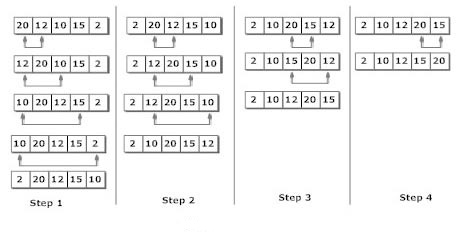

# 选择排序(selection sort)

在选择排序中，在每次传递中选择数组的未排序元素中的最小值，并将其插入到数组中的适当位置。

首先，找到数组的最小元素并将其放在第一个位置。 然后，找到数组的第二个最小元素并将其放在第二个位置。 这个过程一直持续到得到排序的数组。

具有`n`个元素的数组通过使用`n-1`遍选择排序算法进行排序。

- 在第1遍中，将找到数组的最小元素及其索引`pos`。 然后，交换`A[0]`和`A[pos]`。 因此`A [0]`被排序，现在还有`n -1`个要排序的元素。
- 在第2遍中，找到子数组`A[n-1]`中存在的最小元素的位置`pos`。 然后，交换，`A[1]`和`A[pos]`。 因此`A[0]`和`A[1]`被排序，现在留下`n-2`个未排序的元素。
- 在第`n-1`遍中，找到`A[n-1]`和`A[n-2]`之间的较小元素的位置`pos`。 然后，交换`A[pos]`和`A[n-1]`。

因此，通过遵循上述过程，对元素`A[0]`，`A[1]`，`A[2]`，`...`，`A[n-1]`进行排序。




**示例**
考虑以下具有`6`个元素的数组，使用选择排序对数组的元素进行排序。

```c
A = {10, 2, 3, 90, 43, 56};
```

执行排序和交换位置过程如下所示 - 

| 遍次 | pos  | A[0]  | A[1]  | A[2]   | A[3]   | A[4]   | A[5]   |
| ---- | ---- | ----- | ----- | ------ | ------ | ------ | ------ |
| 1    | 1    | **2** | 10    | 3      | 90     | 43     | 56     |
| 2    | 2    | 2     | **3** | 10     | 90     | 43     | 56     |
| 3    | 2    | 2     | 3     | **10** | 90     | 43     | 56     |
| 4    | 4    | 2     | 3     | 10     | **43** | 90     | 56     |
| 5    | 5    | **2** | **3** | **10** | **43** | **56** | **90** |

执行上面排序后，数组中的数据值如下 - 

```
A = {2, 3, 10, 43, 56, 90}
```

**复杂性**

| 复杂性     | 最好情况 | 平均情况 | 最坏情况 |
| ---------- | -------- | -------- | -------- |
| 时间复杂性 | Ω(n)     | θ(n^2)   | o(n^2)   |
| 空间复杂性 | -        | -        | o(1)     |

**算法**

```
SELECTION SORT(ARR, N)

第1步 : 循环第2步和第3步，从 K = 1 到 N-1
第2步 : CALL SMALLEST(ARR, K, N, POS)
第3步 : 将 A[K] 与 ARR[POS] 交换
        [结束循环]
第4步 : 退出

SMALLEST (ARR, K, N, POS)

第1步 : [INITIALIZE] SET SMALL = ARR[K]
第2步 : [INITIALIZE] SET POS = K
第3步 : 循环 J = K+1 至 N -1
            IF SMALL > ARR[J]
                SET SMALL = ARR[J]
                SET POS = J
            [结束IF]
        [结束循环]
第4步 : 返回POS
```

## 使用C语言实现选择排序算法

文件名:sort-selection.c

```c
#include<stdio.h>  
int smallest(int[],int,int);  
void main ()  
{  
    int a[10] = {10, 9, 7, 101, 23, 44, 12, 78, 34, 23};  
    int i,j,k,pos,temp;  
    for(i=0;i<10;i++)  
    {  
        pos = smallest(a,10,i);  
        temp = a[i];  
        a[i]=a[pos];  
        a[pos] = temp;  
    }  
    printf("printing sorted elements...\n");  
    for(i=0;i<10;i++)  
    {  
        printf("%d\n",a[i]);  
    }  
}  
int smallest(int a[], int n, int i)  
{  
    int small,pos,j;  
    small = a[i];  
    pos = i;  
    for(j=i+1;j<10;j++)  
    {  
        if(a[j]<small)  
        {  
            small = a[j];  
            pos=j;  
        }  
    }  
    return pos;  
}
```

```bash
gcc /share/lesson/data-structure/sort-selection.c && ./a.out
```

康康