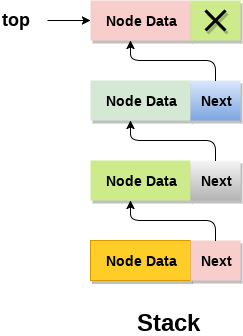
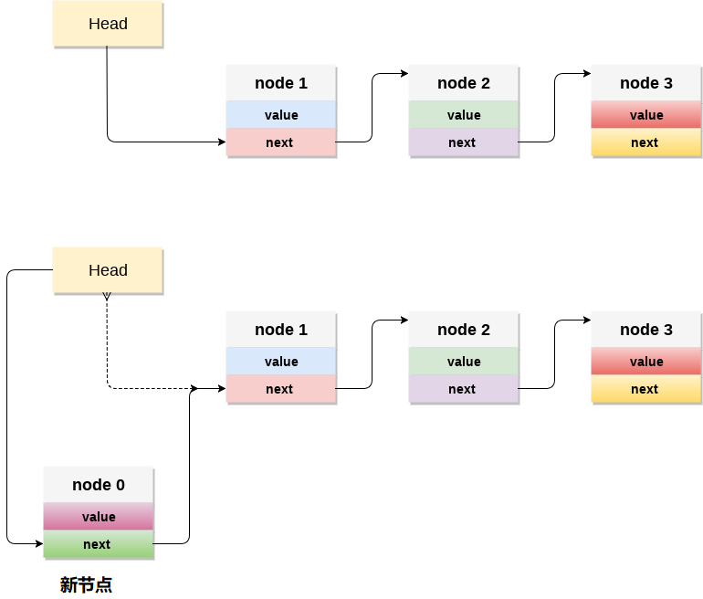

# 堆栈 链表实现堆栈

堆栈也可以使用链表来实现，而不是只能使用数组来实现。链表动态可以分配内存。 然而，两种情况下的时间复杂度对于所有操作是相同的，即推入，弹出和窥视。

在堆栈的链表实现中，节点在存储器中非连续地维护。 每个节点都包含一个指向堆栈中直接后继节点的指针。 如果内存堆中剩余的空间不足以创建节点，则称堆栈溢出。



堆栈中最顶层的节点的地址字段中始终包含`null`。 下面来讨论一下每个操作在堆栈的链表实现中执行的方式。

#### 1. 将节点添加到堆栈(推送操作)

将节点添加到堆栈称为推送操作。 在链表实现中将元素推送到堆栈不同于数组实现的元素。 为了将元素推入堆栈，涉及以下步骤。

- 首先创建一个节点并为其分配内存。
- 如果链表为空，则将数据项作为链表的起始节点推入。 这包括将值分配给节点的数据部分，并将`null`分配给节点的地址部分。
- 如果链表中已经有一些节点，那么需要在链表的开头添加新元素(不违反栈的属性)。 为此，将起始元素的地址分配给新节点的地址字段，并创建新节点，即链表的起始节点。

**时间复杂度： o(1)**



**C语言的代码实现**

```c
void push ()  
{  
    int val;  
    struct node *ptr =(struct node*)malloc(sizeof(struct node));   
    if(ptr == NULL)  
    {  
        printf("not able to push the element");   
    }  
    else   
    {  
        printf("Enter the value");  
        scanf("%d",&val);  
        if(head==NULL)  
        {         
            ptr->val = val;  
            ptr -> next = NULL;  
            head=ptr;  
        }   
        else   
        {  
            ptr->val = val;  
            ptr->next = head;  
            head=ptr;  
        }  
        printf("Item pushed");  

    }  
}
```

#### 2. 从堆栈中删除节点(弹出操作)

从堆栈顶部删除节点称为弹出操作。 从堆栈的链表实现中删除节点与阵列实现中的节点不同。 要从堆栈中弹出元素，需要按照以下步骤操作：

- **检查下溢情况** ：当尝试从已经空的堆栈弹出时就会发生下溢情况。 如果链表的头指针指向`null`，则堆栈将为空。
- **相应地调整头指针**：在堆栈中，元素仅从一端弹出，因此，必须删除存储在头指针中的值，并且必须释放节点。 头节点的下一个节点现在成为头节点。

**时间复杂度：o(n)**

**C语言代码实现**

```c
void pop()  
{  
    int item;  
    struct node *ptr;  
    if (head == NULL)  
    {  
        printf("Underflow");  
    }  
    else  
    {  
        item = head->val;  
        ptr = head;  
        head = head->next;  
        free(ptr);  
        printf("Item popped");  

    }  
}
```

#### 3. 显示节点(遍历)

显示堆栈的所有节点需要遍历以堆栈形式组织的链表的所有节点。 为此，需要遵循以下步骤。

- 将头指针复制到临时指针中。
- 将临时指针移动到链表的所有节点，并打印附加到每个节点的值。

**时间复杂度：o(n)**

**C语言的代码实现**

```c
void display()  
{  
    int i;  
    struct node *ptr;  
    ptr=head;  
    if(ptr == NULL)  
    {  
        printf("Stack is empty\n");  
    }  
    else  
    {  
        printf("Printing Stack elements \n");  
        while(ptr!=NULL)  
        {  
            printf("%d\n",ptr->val);  
            ptr = ptr->next;  
        }  
    }  
}
C
```

## C语言实现的示例代码

文件名:stack-implementation-with-lnikedlist.c

```c
#include <stdio.h>  
#include <stdlib.h>  
void push();
void pop();
void display();
struct node
{
    int val;
    struct node *next;
};
struct node *head;

void main()
{
    int choice = 0;
    printf("*********Stack operations using linked list*********\n");
    printf("----------------------------------------------\n");
    while (choice != 4)
    {
        printf("Chose one from the below options...\n");
        printf("1.Push\n2.Pop\n3.Show\n4.Exit");
        printf("Enter your choice \n");
        scanf("%d", &choice);
        switch (choice)
        {
        case 1:
        {
            push();
            break;
        }
        case 2:
        {
            pop();
            break;
        }
        case 3:
        {
            display();
            break;
        }
        case 4:
        {
            printf("Exiting....");
            break;
        }
        default:
        {
            printf("Please Enter valid choice ");
        }
        };
    }
}
void push()
{
    int val;
    struct node *ptr = (struct node*)malloc(sizeof(struct node));
    if (ptr == NULL)
    {
        printf("not able to push the element");
    }
    else
    {
        printf("Enter the value");
        scanf("%d", &val);
        if (head == NULL)
        {
            ptr->val = val;
            ptr->next = NULL;
            head = ptr;
        }
        else
        {
            ptr->val = val;
            ptr->next = head;
            head = ptr;

        }
        printf("Item pushed");

    }
}

void pop()
{
    int item;
    struct node *ptr;
    if (head == NULL)
    {
        printf("Underflow");
    }
    else
    {
        item = head->val;
        ptr = head;
        head = head->next;
        free(ptr);
        printf("Item popped");

    }
}
void display()
{
    int i;
    struct node *ptr;
    ptr = head;
    if (ptr == NULL)
    {
        printf("Stack is empty\n");
    }
    else
    {
        printf("Printing Stack elements \n");
        while (ptr != NULL)
        {
            printf("%d\n", ptr->val);
            ptr = ptr->next;
        }
    }
}
```

```bash
gcc /share/lesson/data-structure/stack-implementation-with-lnikedlist.c && ./a.out
```

康康