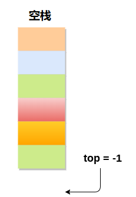

# 堆栈(stack)			

**堆栈(Stack)的简介**

- 堆栈(Stack)是一个有序列表，它只能在顶端执行插入和删除。
- 堆栈(Stack)是一个递归数据结构，具有指向其顶部元素的指针。
- 堆栈有时被称为后进先出(LIFO)列表，即首先插入堆栈的元素将最后从堆栈中删除。

**堆栈的一些应用**

- 递归
- 表达式评估和转换
- 解析
- 浏览器
- 编辑器
- 树遍历

## 堆栈操作

可以在堆栈上执行各种操作。

**1.推入** ：将元素添加到堆栈中，如下图所示：

**2.弹出** ：从堆栈中删除元素，如下图所示：

**3.窥视**：查看堆栈的所有元素而不删除它们。

## 堆栈如何增加？

**场景1** ：堆栈为空

如果堆栈中不包含任何元素，则称为空。 在此阶段，变量`top`的值为`-1`。

**场景2** ：堆栈不为空

每当向堆栈添加任何元素时，`top`的值将增加`1`。 在下面的堆栈中，添加第一个元素后，`top = 2`。

**场景3**：删除元素

每当从堆栈中删除元素时，`top`的值将减少`1`。在下面的堆栈中，从堆栈中删除元素`10`后，`top = 1`。

顶部及其值：

| 顶部位置 | 堆栈状态           |
| -------- | ------------------ |
| -1       | 空                 |
| 0        | 堆栈中只有一个元素 |
| N-1      | 堆栈已满           |
| N        | 溢出               |